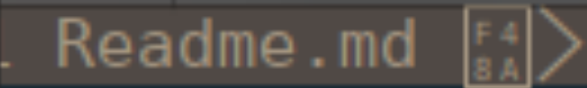

# My Linux configuration
This repository is configuration for [`SpaceVim`](http://spacevim.org/)
[`tilix`](https://gnunn1.github.io/tilix-web/)
[`on-my-zsh`](https://github.com/robbyrussell/oh-my-zsh)
[`autojump`](https://github.com/wting/autojump) 
[`translate-shell`](https://github.com/soimort/translate-shell)
and many other thing which can greatly imporve your life quality under linux.

### Disable Discrete GPU
> It doesn't fix the problem at all, but somewhat leveated.

1. https://wiki.deepin.org/wiki/%E6%98%BE%E5%8D%A1
2. check it worked properly.
https://askubuntu.com/questions/239589/how-do-i-determine-whether-bumblebee-is-working-as-expected

```
# dmdmesg | grep bbswitch
[    1.977523] bbswitch: version 0.8
[    1.977529] bbswitch: Found integrated VGA device 0000:00:02.0: \_SB_.PCI0.GFX0
[    1.977535] bbswitch: Found discrete VGA device 0000:01:00.0: \_SB_.PCI0.RP01.PXSX
[    1.977687] bbswitch: detected an Optimus _DSM function
[    1.977774] bbswitch: disabling discrete graphics
[    2.023149] bbswitch: Succesfully loaded. Discrete card 0000:01:00.0 is off
```

### Faq about SpaceVim

##### 1. Wired Icon
Here is a exampel in tab line:


[install](https://github.com/ryanoasis/vim-devicons/wiki/Installation) a nerd font.

For example:
1. install
```
yaourt -S nerd-fonts-dejavu-complete
```
2. change terminal's font
