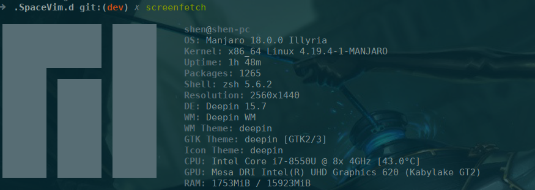

# My Linux configuration
This repository is configuration for [`SpaceVim`](http://spacevim.org/)
[`tilix`](https://gnunn1.github.io/tilix-web/)
[`on-my-zsh`](https://github.com/robbyrussell/oh-my-zsh)
[`autojump`](https://github.com/wting/autojump) 
[`translate-shell`](https://github.com/soimort/translate-shell)
and many other thing which can greatly imporve your life quality under linux.

# Install

# TODO
1. A parallel version of `install_manjaro`
3. Remove .Application dir, need a better apporach
3. Gtags didn't track files in assembly


# General

### Install Oracle Java
1. http://www.oracle.com/technetwork/java/javase/downloads/index-jdk5-jsp-142662.html
2. 需要注册，除了邮件地址, others aren't necessary to be true.
3. usermail is your email address
4. extract it
5. set the PATH in zsh
```
export JAVA_HOME=/develop/jdk1.5.0_22
export JRE_HOME=JAVA_HOME/jre
export CLASSPATH=JAVAHOME/lib:JRE_HOME/lib:$CLASSPATH
export PATH=JAVAHOME/bin:JRE_HOME/bin:$PATH
```

# Deepin

### 切换软件源
1. [deepin](https://www.deepin.org/mirrors/packages/) 提供可替换列表
2. 直接sudo vim 替换 将原来的
```
deb [by-hash=force] http://packages.deepin.com/deepin unstable main contrib non-free
#deb-src http://packages.deepin.com/deepin unstable main contrib non-free
```
中间的 `http://packages.deepin.com/deepin` 中间替换为该目录中间的任意的网址，　比如在华科的话，
可以替换为`http://mirrors.hustunique.com/deepin/`
3. sudo apt update  
当链接的网络需要认证的时候，本步骤一般会报错。

# Manjaro
> pacman makes things much more easy.

### Some setting still need set with hande
1. Xfce Power Manger
In `security` panel, `Automatically lock the session` : `Never`

2. Fix shadowsocks [ref](https://kionf.com/2016/12/15/errornote-ss/)
Read the error to find where is `openssl.py`.
Open `openssl.py`
Replace `cleanup` with `reset`
```
:%s/cleanup/reset/
:x
```
3. Config tilix
    1. In `Manjaro Setting manager` change default software.

### Disable Discrete GPU
> It doesn't fix the problem at all, but somewhat leveated.

1. https://wiki.deepin.org/wiki/%E6%98%BE%E5%8D%A1
2. check it worked properly.
https://askubuntu.com/questions/239589/how-do-i-determine-whether-bumblebee-is-working-as-expected

```
# dmdmesg | grep bbswitch
[    1.977523] bbswitch: version 0.8
[    1.977529] bbswitch: Found integrated VGA device 0000:00:02.0: \_SB_.PCI0.GFX0
[    1.977535] bbswitch: Found discrete VGA device 0000:01:00.0: \_SB_.PCI0.RP01.PXSX
[    1.977687] bbswitch: detected an Optimus _DSM function
[    1.977774] bbswitch: disabling discrete graphics
[    2.023149] bbswitch: Succesfully loaded. Discrete card 0000:01:00.0 is off
```
### Install Deepin Software
1. [dde](https://wiki.archlinux.org/index.php/Deepin_Desktop_Environment) wiki
2. https://linuxconfig.org/how-to-install-deepin-desktop-on-manjaro-18-linux
```
sudo pacman -S deepin
```


1. Some software not installed compared to native deepin, but good enough.
2. Vim markdown preview fixed :chear:
3. Power Comsuming becomes much more devastated.

### Skip all the prompts
1. create a the config file `~/.yaourtrc`
2. add three lines into it
```
NOCONFIRM=1
BUILD_NOCONFIRM=1
EDITFILES=0
```
> Ref https://simplyian.com/2015/02/15/How-to-skip-all-Yaourt-prompts-on-Arch-Linux/

### Faq about SpaceVim

##### 1. Wired Icon
Here is a exampel in tab line:


[install](https://github.com/ryanoasis/vim-devicons/wiki/Installation) a nerd font.

For example:
1. install
```
yaourt -S nerd-fonts-dejavu-complete
```
2. change terminal's font

##### 2. C/Cpp header include
1. Plan A
compile_commands.cpp

As the links show:
https://www.jetbrains.com/help/clion/compilation-database.html

you can use CMake or clang -MJ, this way is limited when you read others projects when neither clang or CMake is not used.

##### 3. Tags
Gtags is a great tools, but language server protocol is a better choice;

### SpaceVim Todos
