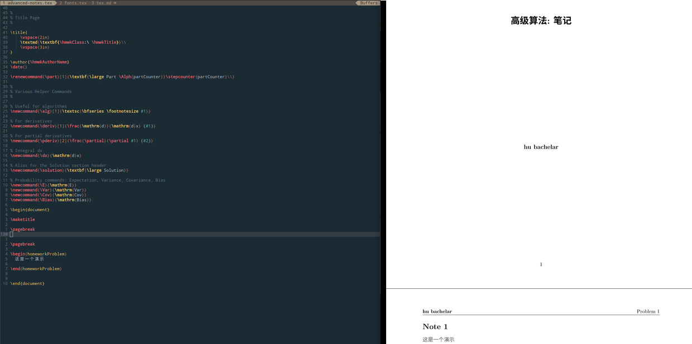

# 2021 年 vim 的 C/C++ 配置

<!-- vim-markdown-toc GitLab -->

- [前言](#前言)
- [背景](#背景)
- [关于如何入门 vim](#关于如何入门-vim)
- [终极解决方案: lsp](#终极解决方案-lsp)
- [丝般顺滑: async](#丝般顺滑-async)
- [为什么使用 SpaceVim](#为什么使用-spacevim)
- [为什么使用 coc.nvim](#为什么使用-cocnvim)
- [为什么应该使用 neovim 而不是 vim](#为什么应该使用-neovim-而不是-vim)
- [安装](#安装)
- [基本操作](#基本操作)
    - [符号搜索](#符号搜索)
    - [导航](#导航)
    - [定义和引用](#定义和引用)
    - [注释](#注释)
    - [格式化](#格式化)
    - [重命名](#重命名)
    - [字符串搜索](#字符串搜索)
    - [文件树](#文件树)
    - [窗口](#窗口)
    - [缓冲区](#缓冲区)
    - [文档](#文档)
    - [代码段](#代码段)
    - [自动补全](#自动补全)
    - [git 集成](#git-集成)
    - [调试集成](#调试集成)
    - [终端](#终端)
- [扩展](#扩展)
    - [基于 SpaceVim 的扩展, 以 Latex 为例子](#基于-spacevim-的扩展-以-latex-为例子)
- [本配置源代码解释](#本配置源代码解释)
- [FAQ](#faq)
- [vim 的小技巧](#vim-的小技巧)
- [vim 调试](#vim-调试)
- [其他的一些资源](#其他的一些资源)
    - [学习](#学习)
    - [主题](#主题)
    - [衍生](#衍生)

<!-- vim-markdown-toc -->


## 前言
首先，任何问题,  欢迎[issue](https://github.com/Martins3/My-Linux-config/issues?q=is%3Aissue)。

本文的目标观众:
1. vim 新手
2. 正在使用 [cscope](http://cscope.sourceforge.net/) / [ctags](https://github.com/universal-ctags/ctags) / [gtags](https://github.com/SpaceVim/SpaceVim/issues/4389) / [nerdtree](https://github.com/preservim/nerdtree) / [YCM](https://github.com/ycm-core/YouCompleteMe) 的 vimer
3. 不了解 [Language Server Protocal](https://microsoft.github.io/language-server-protocol/) (下简称 lsp ) 和 async 的 vimer

本项目不是在于要大家使用我的这个配置，
而是让大家知道 vim 正在飞速进步 ，拥抱 lsp, async, treesitter 和 float window 等新特性，vim 一定的比你想象的酷炫和高效。

## 背景 
我平时主要写 C/C++, 最开始的配置是参考 [github : use vim as ide](https://github.com/yangyangwithgnu/use_vim_as_ide) 写的，
在处理几个文件的小项目时候，比如刷刷 leetcode 之类的，还是勉强够用，但是等到处理 Linux 内核这种超大型的项目的时候，
我发现 gtags / cscope 这种符号索引工具，YouCompleteMe 类似的补全静态检查的工具很难配置，nerdtree 在打开一个含有很多目录的文件的时候，
整个 vim 都会变卡。

曾经为了在 vim 中间写 C/C++，你需要安装 ctags 生成索引，需要安装 ctags 的 vim 插件在 vim 中间使用 ctags，需要安装自动更新索引数据库的插件，安装 YCM 实现静态检查，你还会发现 ctags 存在好几个版本，安装不对，对应的插件也没有办法正常工作。
最最让人崩溃的是，那一天你忽然想使用 vim 写一个新的语言，比如 Java，类似的操作你又需要重新走一遍，而且还要手动映射快捷键，来保证这些快捷键不会互相冲突。

我在想，用 vim 的意义到底是什么，疯狂的自我折磨吗?

## 关于如何入门 vim
其实关于 vim 的基本知识教程有很多，这里我推荐两个网站
1. [openvim](https://www.openvim.com/tutorial.html): 交互式的学习 vim
2. [vim check sheet](https://vim.rtorr.com/lang/zh_cn): vim 常用快捷键清单

如果完全没有基础，建议使用 openvim 打牢基础之后，然后就直接将 vim 用于实战中间，因为这些快捷键都是肌肉记忆，无非多熟悉一下而已。当你知道 hikl 之类的操作之后
使用 vim check sheet 是强化补充的，不要指望一次全部背下来，也没有必要全部记住，一次学几个，学最能提高你工作效率的。

vim 的学习曲线陡峭主要就是在最开始的 hjkl 这些快捷键的记忆，但是最多几天，之后就学习就非常平缓了，无非是装装插件，重新映射一下快捷键之类的事情。

虽然我使用了很长时间的 vim，但是两个东西我依旧觉得非常坑，那就是退出和复制。关于 vim 如何退出，闹出很多笑话，比如有人创建一个[仓库](https://github.com/hakluke/how-to-exit-vim)用于收集各种退出的方法。stackoverflow 的报告说，其帮助了一百万人次如何退出 vim 。

1. 退出: 我使用 `:xa` 退出 vim。 `x` 表示保存并且关闭 buffer，`a`表示运用于所有的。有时候出现意外关闭 vim，再次打开文件可以出现警告，解决办法是 : 首先利用.swp 文件进行恢复，然后手动清理 `~/.cache/SpaceVim/swap` .swp 文件。
    - 至于为什么存在这个 `.swp` 文件以及如何关闭这个选项，可以参考这里。
2. `,` `y` 和 `,` `p` 实现复制粘贴。

## 终极解决方案: lsp
lsp 是微软开发 VSCode 提出的，其定义了一套标准编辑器和 language server 之间的规范。
1. 不同的语言需要不同的 Language Server，比如 C/C++ 需要 [ccls](https://github.com/MaskRay/ccls), Rust 语言采用 [rust analyzer](https://github.com/rust-analyzer/rust-analyzer), 官方列举了很多 [lsp servers](https://microsoft.github.io/language-server-protocol/implementors/servers/)。
2. 不同的编辑按照 lsp 的规范和 language server 通信

他们大致的关系如下, 通过统一的接口，大大的减少了重复开发，lsp 定义的查找引用，定义，格式化代码功能只需要安装对应的 language server 支持就是开箱即用，再也无需从各种插件哪里东拼西凑这些功能。

```txt
 +------------------------+    +-----------------------+
 |                        |    |                       |
 |      Editor            | <--+   Language Server     |
 |                        |    |                       |
 +------------------------+    +-----------------------+
 |     Atom               |    |                       |
 |     Emacs              +--> |   ccls                |
 |     Vim/Neovim         |    |                       |
 |     Visual Studio Code |    |                       |
 |     Monaco Editor      |    |                       |
 +------------------------+    +-----------------------+
```

## 丝般顺滑: async
另一个新特性是 async 。async 的效果当然就是快，当一个插件存在其 async 的版本，那么毫无疑问，就应该使用 async 版本。

文件树插件，我之前一直都是使用 nerdtree 的，直到有一天我用 vim 打开 linux kernel，我发现光标移动都非常的困难，我开始以为是终端的性能问题，但是在 htop 中发现 vim 的 CPU 利用率很高，
直到将 nerdtree 替换为大神 shougou 的 [defx](https://github.com/Shougo/defx.nvim)。

关于 nerdtree 为什么不支持 async 可以参考 [why nerdtree doesn't support async](https://github.com/preservim/nerdtree/issues/1170)。

## 为什么使用 SpaceVim
VSCode 我也使用过一段时间，我觉得 VSCode 之所以学习曲线非常的平缓主要有两个原因，
1. 其提供标准配置给新手就可以直接使用了，但是 vim 没有一个较好的配置，几乎没有办法使用。
2. 官方提供了统一的插件市场，好的插件自动排序，再也不需要像 vim 这里，找到好的插件需要耐心和运气。 vimawesome 在一定程度上解决了这个问题，但是它把 YCM 排在[autocomplete](https://vimawesome.com/?q=autocomplete) 搜索的第一名，我非常的不认可。

目前，[SpaceVim](http://spacevim.org/) 比较好的解决了这些问题，利用社区的力量，SpaceVim 对于各种问题，挑选了对应的优质插件，基本可以实现开箱即用。当然你还是需要知道 vim 的基础知识和简要的阅读 Spacevim 的文档，不过这相对于一步步的配置和踩坑，消耗自己的时间和精力，好太多了。
Spacevim 还有一个很强的地方在于，配置是作为一个插件存在的，可以不断升级，而 [github: LunarVim](https://github.com/ChristianChiarulli/LunarVim) 这种配置，fork 到自己的分支，修改，想要升级就要 merge 主线上的冲突。

## 为什么使用 coc.nvim
最开始的时候，vim / neovim 都是没有内置 lsp 功能的，在 vim 下想要使用 lsp 就要靠 [coc.nim](https://github.com/neoclide/coc.nvim) 这种插件，类似的工具官方列举了很多 [lsp tools](https://microsoft.github.io/language-server-protocol/implementors/tools/), 
coc.nvim 的宗旨就是*full language server protocol support as VSCode*, 虽然后来 neovim 内置了，但是到目前为止，我还是认为内置的 lsp 和 coc.nvim 的完善度还是存在一些差距。
reddit 上的一些老哥目前认为 coc.nvim 的自动补全做的更好，开箱即用。[^1]

不过，内置 lsp 和 lua 作为配置语言是 neovim 的一个新的发展趋势，我们就静观其变吧，也许有一天 coc.nvim 的功能会被完全集成到 neovim 内部。
## 为什么应该使用 neovim 而不是 vim
其实 vim 还有一个祖先叫做 vi, vim 全称为 vi improve, 但是 vim 在很长一段时间更新的不大，neovim 的作者提交了一个很大的 patch 给 vim，但是被 vim 的作者拒绝了，
因为这个 patch 太大了，改动太多，然后 neovim 的作者就开始自立门户搞了一个 neovim，很多 vim 特性都是被 neovim 逼出来的。总体来说，neovim 相较于 vim :
1. 更新更快, 添加的新功能更多，例如内置 lsp, lua 语言的支持。
2. 社区更活跃。这个你对比一下 vim 和 neovim 的开发者数量就可以知道了，vim 很长时间都只有一个人开发的。
3. 很多插件依赖 neovim 新特性，或者只能在 vim 上勉强使用。

根据 stackoverflow 的报告指出 [Neovim is the most loved editor it is the 10th most wanted editor](https://insights.stackoverflow.com/survey/2021#section-most-loved-dreaded-and-wanted-collaboration-tools)

## 安装
安装可以参考 install 目录下的的脚本(有待完善和测试)，下面是详细的解释。安装成功需要注意两点:
1. 代理 : 尽管 python, pacman/apt-get/yum，npm, docker 都是可以使用国内镜像，但是部分还是需要国外的，比如 Microsoft Python Language Server 。 实现代理的方法在 github 上有很多教程，也可以参考[我的 blog](https://martins3.github.io/gfw.html)
2. 软件版本 : 在 Ubuntu 16.04 上安装简直是一个噩梦，很多软件需要手动编译，不过在 Ubuntu 20.04 上问题不大，下面以 20.04 作为例子，其他的 distribution 例如 Arch Linux, Manjaro 应该类似。

本配置的架构如下图所示。
```txt
+-----------------+
|                 |
|     my config   | 在 SpaceVim 的基础上整合 coc.nvim，同时添加一些插件和配置
|                 |
+-----------------+
|                 |
|     coc.nvim    | 提供 lsp 功能，提供类似 VSCode 的优雅体验，完美支持C/C++。
|                 | coc.nvim 同样可以添加插件，比如 coc-clang。
+-----------------+
|                 |
|     SpaceVim    | 一个模块化，功能齐全的 vim distribution。
|                 |
+-----------------+
|                 |
|     Neovim      | 编辑器，当没有任何配置的时候，比较难用。
|                 |
+-----------------+
```
整个环境的安装主要是 neovim SpaceVim coc.nvim ccls，下面说明一下安装主要步骤以及其需要注意的一些小问题。对于新手，安装过程并不简单，遇到问题多 Google，或者 issue 直接和我讨论。

- 当前配置需要 neovim 0.5 以上的版本，这个需要[手动安装](https://github.com/neovim/neovim/wiki/Installing-Neovim)

如果所有的依赖都安装了，其实也就是下面三条命令
```sh
git clone https://github.com/neovim/neovim && cd neovim
make CMAKE_BUILD_TYPE=Release -j8
sudo make install
```

```txt
➜  .SpaceVim.d git:(2021) ✗ nvim --version
NVIM v0.6.0-dev+263-gb9d57fa10
Build type: Release
LuaJIT 2.1.0-beta3
Compiled by maritns3@maritns3-pc

Features: +acl +iconv +tui
See ":help feature-compile"

   system vimrc file: "$VIM/sysinit.vim"
  fall-back for $VIM: "/usr/local/share/nvim"

Run :checkhealth for more info
```

- 第二步， 按照 Spacevim 安装的[官方文档](https://spacevim.org/cn/quick-start-guide/)安装 SpaceVim。
- 安装 yarn 和 nodejs
- **保证 yarn/npm 使用国内镜像，部分插件需要使用 yarn/npm 安装，如果不切换为国内镜像，***很容易***出现安装失败。**，切换方法参考[这里](https://zhuanlan.zhihu.com/p/35856841). 安装完成之后检查:

```txt
➜  Vn git:(master) ✗ yarn config get registry && npm config get registry
https://registry.npm.taobao.org
https://registry.npm.taobao.org/
```

- 安装 ccls。也可以参考其[官方文档](https://github.com/MaskRay/ccls/wiki/Build)手动编译获取最新版。

```txt
➜  Vn git:(master) ✗ sudo apt install ccls
```

- 复制本配置

```sh
cd ~ # 保证在根目录
rm -r .SpaceVim.d # 将原来的配置删除
git clone https://github.com/martins3/My-Linux-config .SpaceVim.d 
nvim # 打开vim 将会自动安装所有的插件
```

- 在 nvim 中间执行 `checkhealth` 命令，其会提醒需要安装的各种依赖, 比如 xclip 没有安装，那么和系统的 clipboard 和 vim 的 clipboard 之间复制会出现问题。neovim 的 python 的没有安装可能导致直接不可用。

```sh
sudo apt install xclip

# archlinux 请使用 wl-clipboard 替代xclip
# sudo pacman -S wl-clipboard

# 安装 python3 的依赖
sudo pip3 install neovim
sudo pip3 install pynvim

# 安装 treesitter
cargo install tree-sitter-cli

# 让系统选择 https://github.com/sharkdp/fd
ln -s $(which fdfind) ~/.local/bin/fd
```

注: 
1. 感谢 [@Limaomao821](https://github.com/Martins3/My-Linux-config/issues/10) 指出，其中 Python2, Ruby 和 perl 的依赖是不需要安装。
2. 感谢 [@Korov](https://github.com/Martins3/My-Linux-config/issues/11) 指出 archlinux 的剪切板使用 wl-clipboard


例如下面是我的配置的截图。


- 安装[bear](https://github.com/rizsotto/Bear)。ccls 需要通过 bear 生成的 compile_commands.json 来构建索引数据。

```sh
sudo apt install bear
```

注：使用 bear 生成 compile_commands.json 是一种通用的方法，但是不同的 build 工具和项目还存在一些捷径可走:
1. linux 内核使用自带的脚本 `scripts/clang-tools/gen_compile_commands.py`，具体可以参考[这里](https://patchwork.kernel.org/patch/10717125/)，这样的话就不用更改一次 .config 就重新编译整个内核。
2. QEMU 项目使用 meson 构建的，其会自动在 build 文件夹中生成 compile_commands.json, 直接拷贝到项目的顶层目录就可以了。
2. cmake [生成 compile_commands.json 的方法](https://stackoverflow.com/questions/23960835/cmake-not-generating-compile-commands-json)
3. [ninja](https://ninja-build.org/manual.html)
4. [ccls documentation for more](https://github.com/MaskRay/ccls/wiki/Project-Setup)

一个工程只要生成 compile_commands.json，那么一切就大功告成了。

- 安装 cppman 可以在 vim 展示 https://en.cppreference.com/w/ 的文档
```sh
sudo apt install cppman
cppman -c # 缓存数据
```
- 需要修改 terminal 的字体位 nerdfonts 中才不会出现乱码。 先[下载](https://www.nerdfonts.com/font-downloads)，在[安装](https://gist.github.com/matthewjberger/7dd7e079f282f8138a9dc3b045ebefa0)，最后设置就好了。

## 基本操作
基本操作是所有人都需要的比如，`h` `j` `k` `l` `e` `w` `b` `g` 等等就不说了。下面说明的内容只是我的常用操作，更多详细的操作请移步到 SpaceVim，coc.nvim，ccls 以及特定插件的文档。

三个最核心的 leader 键:

| `,`               | `c`      | `<Space>`                 |
|-------------------|----------|---------------------------|
| coc.nvim 相关操作 | 窗口操作 | SpaceVim 提供的大多数操作 |

这三个键位都是可以重新映射的。

#### 符号搜索
利用 [telescope](https://github.com/nvim-telescope) 快速搜索 file，buffer，function 等

| key binding | function                 |
|-------------|--------------------------|
| `,` `o`     | 在当前文件中间搜索该符号 |
| `,` `s`     | 整个工程中间搜索该符号   |

在 fork.c 中间搜索 `_x64_sys_fork` 这个符号:


在整个 Linux 工程中间搜索 sysclone 这个符号:


#### 导航
1. telescope 同样可以用于搜索文件使用 `,` `f` + 文件名, 同样的，搜索 buffer 的方法类似 : `,` `b` + buffer 名称。


2. 利用 [vista](https://github.com/liuchengxu/vista.vim) 实现函数侧边栏导航(类似于 tagbar) ，打开关闭的快捷键 `<Fn2>`。

<p align="center">
  
</p>

#### 定义和引用

| key binding | function                                                                      |
|-------------|-------------------------------------------------------------------------------|
| `g` `d`     | 跳转到定义                                                                    |
| `g` `r`     | 当只有一个 ref 的时候，直接跳转，当存在多个的时候，显示如下窗口，可以逐个选择 |

#### 注释

| key binding | function                                             |
|-------------|------------------------------------------------------|
| `K`         | 可以查询函数，变量，宏等，注释将会显示在悬浮窗口上。 |


#### 格式化

| key binding     | function                                          |
|------------------|-------------------------------------------------|
| `Space` `r`  `f` | 格式化当前文件，支持 C/C++ , Rust 和 Python 等。 |

可以通过一个工程的目录下的 `.clang-format` 来实现配置 C/C++ 的格式样式:
1. https://github.com/MaskRay/ccls/blob/master/.clang-format : 将代码格式为 LLVM 风格
2. https://github.com/torvalds/linux/blob/master/.clang-format : 代码格式为 linux kernel 风格

#### 重命名
有时候，写了一个函数名，然后多次调用，最后发现函数名的单词写错了，一个个的修改非常的让人窒息。使用 `,` `r` `n` 在需要重命名的元素上，即可批量重命名。

#### 字符串搜索
[vim-searchindex](https://github.com/google/vim-searchindex) 可以显示当前是第几个文本项:


spacevim 配置提供了强大的[异步搜索功能](https://spacevim.org/grep-on-the-fly-in-spacevim/), 比较常用的是:

| key binding     | function                                          |
|-----------------|---------------------------------------------------|
| `Space` `s` `/` | 实时动态搜索(grep on the fly)                     |
| `Space` `s` `p` | 在整个工程中搜索该字符串                          |
| `Space` `s` `b` | 在所有打开 buffer 中搜索该字符串                  |
| `Space` `s` `P` | 在整个工程中搜索**对于光标所在**字符串            |
| `Space` `s` `b` | 在所有打开的 buffer 中搜索**对于光标所在** 字符串 |


#### 文件树
参考 SpaceVim 的[文档](https://spacevim.org/documentation/#file-tree)，我这里总结几个我常用的:

| key binding     | function                                          |
|-----------------|---------------------------------------------------|
| `Space` `f` `o` | 将当前的文件显示在 filetree 中间                    |
| `r`             | 相当于 shell 中间的 mv 命令，实现文件的重命名或者移动 |
| `d`             | 删除                                              |
| `j`             | 向下移动                                          |
| `k`             | 向上移动                                          |
| `N`             | 创建文件/文件夹                                   |

更多详细使用，可以直接阅读 SpaceVim 的源代码，位置在 : `~/.SpaceVim/config/plugins/defx.vim`

#### 窗口
因为 window leader 键位被我重新映射为 `c`，如果 window leader 是被映射其他键位，比如 `x`, 那么水平拆分为 `x` `g`
```vim
    " 重新映射 window leader 键位
    let g:spacevim_windows_leader = 'c'
```


| key binding       | function       |
|-------------------|----------------|
| `<Tab>`           | 进入下一个窗口 |
| `c` `g`           | 水平拆分窗口   |
| `q`               | 关闭窗口       |
| `<Space>` `w` `m` | 当前窗口最大化 |


#### 缓冲区

| key binding       | function                                                                  |
|-------------------|---------------------------------------------------------------------------|
| `,` `b`           | 搜索 buffer，前面提到过的，这个主要用于打开的 buffer 的数量非常多的情况下 |
| `,` num           | 切换当前窗口到第 num 个 buffer                                            |
| `<Space>` `b` `c` | 关闭其他已经保存的 buffer                                                 |

#### 文档
在需要查询的函数上 : `Ctrl` `]`，相关文档将会显示在窗口上方。使用本功能需要安装[cppman](https://github.com/aitjcize/cppman) 以及缓存文档。
```sh
pip install cppman
cppman -c
```


和`查找注释`的功能区别在于，`K`是找到该函数的定义，然后显示函数或者变量"附近"(函数上方或者变量右侧的注释)，而查找文档是从 http://cplusplus.com/ 和 http://cppreference.com/ 中间获取文档。

#### 代码段
基于[UltiSnips](https://github.com/SirVer/ultisnips/blob/master/doc/UltiSnips.txt) 可以自己向 UltiSnips/c.snippets，UltiSnips/cpp.snippets 中间添加 C/C++ 的自己定义代码段。 以前刷 OJ 的时候每次都不知道要加入什么头文件，然后就写了一个自定义 snippet，一键加入所有常用的头文件。

```snippets
snippet import
#include <iostream>
// 省略部分头文件，具体内容在下方的截图中间
#include <unordered_map>

using namespace std;

int main(){
	${0}
	return 0;
}
endsnippet
```

这样，然后每次只需要输入 import 这些内容就自动出现了，效果如下。


#### 自动补全
自动补全是自动触发的，coc.nvim 无需另外的配置，效果如下。
<p align="center">
  
</p>
使用 `tab` 来确认选择，使用 `Crtl` `j` 和 `Ctrl` `k` 来移动


#### git 集成
SpaceVim 的[git layer](https://spacevim.org/layers/git/) 对于 git 的支持非常好，其相关的快捷键都是 `<Space>` `g` 开头的，非常好用。

在此基础上，我添加两个小功能:
1. [lazygit](https://github.com/jesseduffield/lazygit)，利用 [floaterm](https://github.com/voldikss/vim-floaterm)，在 vim 中间运行 lazygit。
2. [GitMessenger](https://github.com/voldikss/vim-floaterm)可以显示所在行的 git blame 信息。
```vim
call SpaceVim#custom#SPC('nnoremap', ['g', 'm'], 'GitMessenger', 'show commit message in popup window', 1)
call SpaceVim#custom#SPC('nnoremap', ['g', 'l'], 'FloatermNew lazygit', 'open lazygit in floaterm', 1)
```

#### 调试集成
现在还没有很好的方法实现调试继承。我个人平时使用下面两个项目辅助 gdb 的使用:
1. https://github.com/cyrus-and/gdb-dashboard
2. https://www.gdbgui.com/

更多的参考 : https://scattered-thoughts.net/writing/the-state-of-linux-debuggers/

如果恰好用的是 rust, 可以参考: https://github.com/simrat39/rust-tools.nvim

#### 终端
利用 `voidkiss/folaterm` 可以实现将终端以 float window 的形式打开，映射的快捷键分别为:
- `Ctrl` `n` : 创建新的 terminal window
- `Ctrl` `p` : 切换到 `prev` 的 terminal window
- `Fn5` : 显示/隐藏窗口

下面是在打开悬浮终端，并且运行 htop 的结果:

## 扩展
需要说明的是，本配置并不局限于 C/C++，只是相对其他语言，我比较熟悉 C/C++，所以以此为例。由于 SpaceVim 的 layer 和 coc.nvim 的 extension，将上述内容可以非常容易迁移到其他类型的工作上。

#### 基于 SpaceVim 的扩展, 以 Latex 为例子
- 如何扩展

在 init.toml 中间添加
```toml
[[layers]]
  name = "lang#latex"
```

- 效果

`Space` `l` `l` 启动编译， 保存的时候，自动更新，并且更新输出到 zathura 中间。


- 原理

SpaceVim 的强大之处是将众多插件融合在一起，当在使用 latex layer，那么 spacevim 会自动让包管理器安装 [vimtex](https://github.com/lervag/vimtex)，并且重新映射快捷键。
看一下其[文档](https://spacevim.org/layers/lang/latex/)和[源码](https://github.com/SpaceVim/SpaceVim/blob/master/autoload/SpaceVim/layers/lang/latex.vim)就非常清楚了。

- 说明

如果想要书写中文，需要修改默认的 latex engine，在 ~/.latexmkrc 中设置:
```txt
$pdf_mode = 5; 
```
参考:
- https://tex.stackexchange.com/questions/429274/chinese-on-mactex2018-simple-example
- https://tex.stackexchange.com/questions/501492/how-do-i-set-xelatex-as-my-default-engine

## 本配置源代码解释
总体来说，本配置的代码就是从上面介绍的各个项目提供的标准配置的组合，然后添加我的一些微调。

本配置的主要组成:
1. init.toml : 基础配置，几乎是 SpaceVim 标准配置，在此处可以自己添加新的插件
2. autoload/myspacevim.vim : 一些插件的配置，一些快捷键
3. plugin/coc.vim : coc.nvim 和 ccls 的配置，几乎是[coc.nvim 标准配置](https://github.com/neoclide/coc.nvim#example-vim-configuration) 和 [ccls 提供给 coc.nvim 的标准配置](https://github.com/MaskRay/ccls/wiki/coc.nvim) 的复制粘贴。
4. plugin/defx.vim : 添加了一条让 defx 忽略各种二进制以及其他日常工作中间不关心的文件。
5. plugin/lua.vim : 有一些插件的配置现在只能使用 lua 来配置
6. UltiSnips/ : 通过安装 [vim-snippets](https://github.com/honza/vim-snippets)已经安装了非常多的 snippets，可以在 UltiSnips 下添加自定义的插件

SpaceVim 的文档很多时候是不详细的，直接阅读代码往往是更加好的方法，比如如果想知道 defx 的使用方法，进入到 ~/.SpaceVim/ 中间，找到 defx.vim 直接阅读代码即可。

一些快捷键的说明:
1. `<Fn3>` 打开文件树
2. `<Fn4>` 我自己写的一键运行文件，支持语言的单文件执行如 C/C++, Java, Rust 等，我个人用于刷题的时候使用。跟过配置参考具体的源代码。
3. `<Space>`  `l`  `p` 预览 markdown

## FAQ
- 为什么不使用 IDE，比如 [CLion](https://www.jetbrains.com/clion/)?
    - 恰恰相反，我反对新手一开始就折腾 vim ，刚开始学编程，CLion 我认为是最好的 IDE 。[Code::Blocks](https://www.codeblocks.org/) 过于陈旧，[Visual Studio](https://visualstudio.microsoft.com/zh-hans/) 是 Windows 平台独占。而 CLion 保持了 jetbrains 的一贯高水平，简单易用，不要需要掌握太多 gcc 工具链的知识，只要点击一下 绿色的小三角就可以运行代码，而且使用校园邮箱是可以申请免费使用的。 但是，对于老司机，IDE 提供了太多了太多我们不需要的功能，可定制太差，如果我同时想要写多门语言，那么就要同时购买多个 IDE 。

- 为什么不使用 VSCode ?
    - VSCode 比 Sublime 功能更强，比 [Atom](https://atom.io/) 性能更高，而且 VSCode 内部是可以继承 vim 的。VSCode 因为是基于 electron 的，甚至可以在一个 window 编辑 markdown, 一个 window 实时预览 markdown 。但是 vim 在简洁, 灵活和高效的极致的。

- 我应该使用这个配置吗 ?
    - 我认为仓库的意义是让大家使用上 vim 新特性，其实还有很多的其他的配置也非常不错，但是一些常年没有更新，以及使用老旧插件的配置就不用看。比如 use_vim_as_ide, [exvim](https://exvim.github.io/), [spf13-vim](https://github.com/spf13/spf13-vim), [The Ultimate vimrc](https://github.com/amix/vimrc) 之类的。

- 为什么不使用 lua 和 built-in ?
    - 首先，我强烈推荐推荐你看看 [NvChad](https://github.com/NvChad/NvChad) 这个项目。
    - 总体来说，lua 和 built-in 的很多事情正在被折腾中，很多东西变化很快。
    - 其实很多插件已经开始只提供 lua 的配置方法了，相关的资料暂时收藏到[这里](https://github.com/Martins3/My-Linux-config/issues/15)
    - [SpaceVim 也是正在打算支持 lua 的](https://github.com/SpaceVim/SpaceVim/issues/4389)

## vim 的小技巧
- 翻滚屏幕

| key binding | function                               |
|-------------|----------------------------------------|
| H           | 保持屏幕内容不动, 移动到屏幕最上方     |
| M           | 保持屏幕内容不动, 移动到屏幕中间       |
| L           | 保持屏幕内容不动, 移动到屏幕最下面     |
| zt          | 将当前行移动到屏幕最上方               |
| zz          | 将当前行移动到屏幕中间                 |
| zb          | 将当前行移动到屏幕最下方               |
| Ctrl + f    | 向前滚动一屏，但是光标在顶部           |
| Ctrl + d    | 向前滚动一屏，光标在屏幕的位置保持不变 |
| Ctrl + b    | 向后滚动一屏，但是光标在底部           |
| Ctrl + u    | 向后滚动半屏，光标在屏幕的位置保持不变 |
| Ctrl + e    | 向上滚动                               |
| Ctrl + y    | 向下滚动                               |

- vim 下的 Man 命令打开的 manual 是带高亮和符号跳转的，比在终端中间直接使用 man 好多了
- 在最后一行添加相同的字符 `Ctrl + v` `$` `A` `string appended`，[参考](https://stackoverflow.com/questions/594448/how-can-i-add-a-string-to-the-end-of-each-line-in-vim)。
- 在 Esc 是 vim 中间使用频率非常高的键位，为了不让自己的左手小拇指被拉长，可以将 CapsLock 键映射为 Esc 键，一种修改方法为在 ~/.profile 中加入。这个方法存在一个小问题，就是需要打开一个终端窗口才可以加载这个，应为 .profile 在 login 的时候才会被执行一次。
```txt
setxkbmap -option caps:swapescape
```
- 重新映射 escape 也可以使用 spacevim 的内置方案
```vim
  let g:spacevim_escape_key_binding = 'jk'
```

## vim 调试
有时候，有的 vim 插件会出现问题，为了更好的排除不是其他的配置导致的，可以创建一个最简环境。

创建一个 mini.vim 其内容为:
```vim
set nocompatible              " be iMproved, required
filetype off                  " required

" set the runtime path to include Vundle and initialize
set rtp+=/tmp/vim/Vundle.vim
call vundle#begin(/tmp/vim/)
" alternatively, pass a path where Vundle should install plugins
"call vundle#begin('~/some/path/here')

" let Vundle manage Vundle, required
Plugin 'VundleVim/Vundle.vim'
Plugin 'jauler/vim-auto-gcov-marker'

" All of your Plugins must be added before the following line
call vundle#end()            " required
filetype plugin indent on    " required
```
然后运行 nvim -u mini.vim 来加载最为单纯的 vim 环境

## 其他的一些资源
- [C/C++ 项目利用 include-what-you-use 自动优化头文件的引用](https://github.com/include-what-you-use/include-what-you-use)

#### 学习
2. [vim galore](https://github.com/mhinz/vim-galore)
3. [devhints](https://devhints.io/vimscript) : 另一个 vim checksheet

#### 主题
1. [dracula](https://draculatheme.com/vim/) 目前感觉最好看的主题之一
2. [vimcolors](http://vimcolors.com/) vim 主题网站

#### 衍生
1. [vim cube](https://github.com/oakes/vim_cubed) : 让 vim 在三维中显示
2. [vim.wasm](https://github.com/rhysd/vim.wasm) : 在 vim 在网页中间使用
3. [neovide](https://github.com/Kethku/neovide) : 一个酷炫的 GUI 客户端

[^1]: https://www.reddit.com/r/neovim/comments/p3ji6d/nvimlspconfig_or_cocnvim/
[^7]: [stack overflow helping one million developers exit vim](https://stackoverflow.blog/2017/05/23/stack-overflow-helping-one-million-developers-exit-vim/)
[^8]: [what is the purpose of swap files](https://vi.stackexchange.com/questions/177/what-is-the-purpose-of-swap-files)
 
<script src="https://utteranc.es/client.js" repo="Martins3/My-Linux-Config" issue-term="url" theme="github-light" crossorigin="anonymous" async> </script>
**转发 CSDN 按侵权追究法律责任，其它情况随意。**
