# 2022 年 vim 的 C/C++ 配置

<!-- vim-markdown-toc GitLab -->

* [前言](#前言)
* [背景](#背景)
* [关于如何入门 vim](#关于如何入门-vim)
* [终极解决方案: lsp](#终极解决方案-lsp)
* [丝般顺滑: async](#丝般顺滑-async)
* [智能高亮: treesitter](#智能高亮-treesitter)
* [为什么使用 coc.nvim](#为什么使用-cocnvim)
* [为什么应该使用 neovim 而不是 vim](#为什么应该使用-neovim-而不是-vim)
* [安装](#安装)
    * [安装各种依赖](#安装各种依赖)
    * [安装 nvim](#安装-nvim)
    * [安装 yarn 和 nodejs](#安装-yarn-和-nodejs)
    * [安装 ccls](#安装-ccls)
    * [安装 nerdfonts](#安装-nerdfonts)
    * [安装 github cli](#安装-github-cli)
    * [安装 bear](#安装-bear)
    * [安装包管理器 Packer](#安装包管理器-packer)
    * [安装本配置](#安装本配置)
    * [checkhealth 检查](#checkhealth-检查)
* [升级](#升级)
* [基本操作](#基本操作)
    * [退出](#退出)
    * [复制粘贴](#复制粘贴)
    * [符号搜索](#符号搜索)
    * [定义和引用](#定义和引用)
    * [注释](#注释)
    * [格式化](#格式化)
    * [重命名](#重命名)
    * [字符串搜索](#字符串搜索)
    * [file tree](#file-tree)
    * [window](#window)
    * [buffer](#buffer)
    * [导航](#导航)
    * [文档](#文档)
    * [代码段](#代码段)
    * [自动补全](#自动补全)
    * [git 集成](#git-集成)
    * [github 集成](#github-集成)
    * [调试集成](#调试集成)
    * [vim cmdline](#vim-cmdline)
    * [终端](#终端)
    * [一键运行代码](#一键运行代码)
    * [一键注释代码](#一键注释代码)
    * [markdown 集成](#markdown-集成)
* [本配置源代码解释](#本配置源代码解释)
* [FAQ](#faq)
* [vim 的小技巧](#vim-的小技巧)
* [调试 vim 配置](#调试-vim-配置)
* [Changelog](#changelog)
  * [2022](#2022)
* [值得一看的配置](#值得一看的配置)
* [值得关注的插件](#值得关注的插件)
* [blog](#blog)
* [学习](#学习)
* [主题](#主题)
* [衍生](#衍生)

<!-- vim-markdown-toc -->


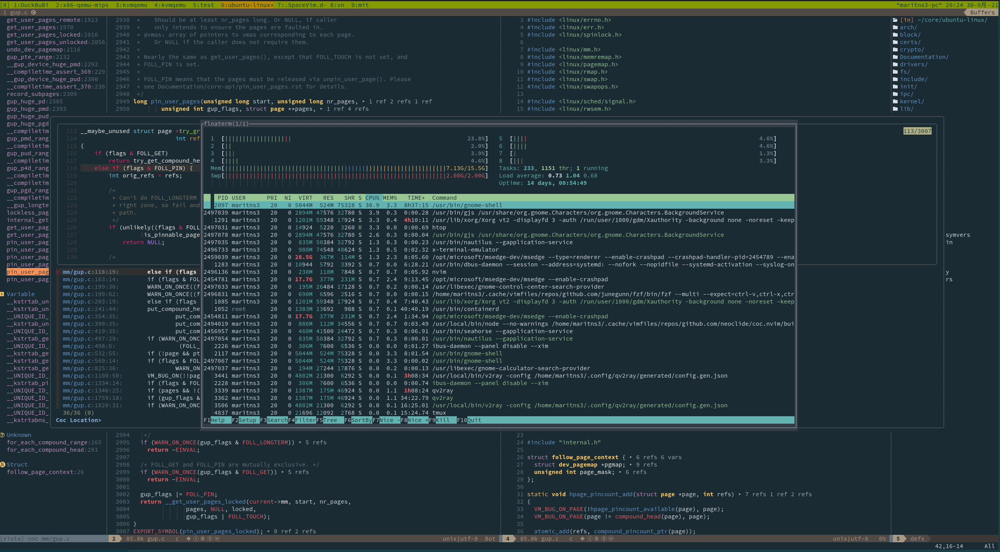

## 前言
首先，任何问题, 欢迎[issue](https://github.com/Martins3/My-Linux-config/issues?q=is%3Aissue)。

本文的目标观众:
1. vim 新手
2. 正在使用 [cscope](http://cscope.sourceforge.net/) / [ctags](https://github.com/universal-ctags/ctags) / [gtags](https://github.com/SpaceVim/SpaceVim/issues/4389) / [nerdtree](https://github.com/preservim/nerdtree) / [YCM](https://github.com/ycm-core/YouCompleteMe) 的 vimer
3. 不了解 [Language Server Protocal](https://microsoft.github.io/language-server-protocol/) (下简称 lsp ) 等新特性的 vimer

本项目不是在于要大家使用我的这个配置，而是让大家知道 vim 正在飞速进步 ，拥抱 lsp, async, treesitter 和 float window 等新特性，vim 一定的比你想象的酷炫和高效。
## 背景
我平时主要写 C/C++, 最开始的配置是参考 [github : use vim as ide](https://github.com/yangyangwithgnu/use_vim_as_ide) 写的，
在处理几个文件的小项目时候，比如刷刷 leetcode 之类的，还是勉强够用，但是等到处理 Linux 内核这种超大型的项目的时候，
我发现 gtags / cscope 这种符号索引工具，YouCompleteMe 类似的补全静态检查的工具很难配置，nerdtree 在打开一个含有很多目录的文件的时候，
整个 vim 都会变卡。

曾经为了在 vim 中间写 C/C++，你需要安装 ctags 生成索引，需要安装 ctags 的 vim 插件在 vim 中间使用 ctags，需要安装自动更新索引数据库的插件，安装 YCM 实现静态检查，你还会发现 ctags 存在好几个版本，安装不对，对应的插件也没有办法正常工作。
最最让人崩溃的是，那一天你忽然想使用 vim 写一个新的语言，比如 Java，类似的操作你又需要重新走一遍，而且还要手动映射快捷键，来保证这些快捷键不会互相冲突。

## 关于如何入门 vim
其实关于 vim 的基本知识教程有很多，这里我推荐两个网站
1. [openvim](https://www.openvim.com/tutorial.html): 交互式的学习 vim
2. [vim check sheet](https://vim.rtorr.com/lang/zh_cn): vim 常用快捷键清单

如果完全没有基础，建议使用 openvim 打牢基础之后，然后就直接将 vim 用于实战中间，因为这些快捷键都是肌肉记忆，无非多熟悉一下而已。当你知道 hikl 之类的操作之后
使用 vim check sheet 来强化补充一下，不要指望一次全部背下来，也没有必要全部记住，一次学几个，学最能提高你工作效率的。

vim 的学习曲线陡峭主要就是在最开始的 hjkl 这些快捷键的记忆，但是最多几天，之后就学习就非常平缓了，无非是装装插件，重新映射一下快捷键之类的事情。

## 终极解决方案: lsp
lsp 是微软开发 VSCode 提出的，其定义了一套标准编辑器和 language server 之间的规范。
1. 不同的语言需要不同的 Language Server，比如 C/C++ 需要 [ccls](https://github.com/MaskRay/ccls), Rust 语言采用 [rust analyzer](https://github.com/rust-analyzer/rust-analyzer), 官方列举了很多 [lsp servers](https://microsoft.github.io/language-server-protocol/implementors/servers/)。
2. 不同的编辑按照 lsp 的规范和 language server 通信

他们大致的关系如下, 通过统一的接口，大大的减少了重复开发，lsp 定义的查找引用，定义，格式化代码功能只需要安装对应的 language server 支持就是开箱即用，再也无需从各种插件哪里东拼西凑这些功能。

```txt
+------------------------+    +---------------+
|      Editor            |    |Language Server|
+------------------------+    +---------------+
|     Emacs              |    |               |
|     Neovim(coc.nvim)   +--> |      ccls     |
|     Visual Studio Code |    |               |
+------------------------+    +---------------+
```

## 丝般顺滑: async
另一个新特性是 async 。async 的效果当然就是快，当一个插件存在其 async 的版本，那么毫无疑问，就应该使用 async 版本。

文件树插件，我之前一直都是使用 nerdtree 的，直到有一天我用 vim 打开 Linux kernel，我发现光标移动都非常的困难，我开始以为是终端的性能问题，但是在 htop 中发现 vim 的 CPU 利用率很高，
直到将 nerdtree 替换为 [nvim-tree](https://github.com/kyazdani42/nvim-tree.lua) 之类的

关于 nerdtree 为什么不支持 async 可以参考 [why nerdtree doesn't support async](https://github.com/preservim/nerdtree/issues/1170)。

## 智能高亮: treesitter
[treesitter](https://github.com/tree-sitter/tree-sitter) 通过解析语法树，让文本的高亮更加的智能和高效。

## 为什么使用 coc.nvim
最开始的时候，vim / neovim 都是没有内置 lsp 功能的，在 vim 下想要使用 lsp 就要靠 [coc.nim](https://github.com/neoclide/coc.nvim) 这种插件，类似的工具官方列举了很多 [lsp tools](https://microsoft.github.io/language-server-protocol/implementors/tools/),
coc.nvim 的宗旨就是*full language server protocol support as VSCode*, 虽然后来 neovim 内置了，但是到目前为止，我还是认为内置的 lsp 和 coc.nvim 的完善度还是存在一些差距。
reddit 上的一些老哥目前认为 coc.nvim 的自动补全做的更好，开箱即用。[^1]

## 为什么应该使用 neovim 而不是 vim
其实 vim 还有一个祖先叫做 vi, vim 全称为 vi improve, 但是 vim 在很长一段时间更新的不大，neovim 的作者提交了一个很大的 patch 给 vim，但是被 vim 的作者拒绝了，
因为这个 patch 太大了，改动太多，然后 neovim 的作者就开始自立门户搞了一个 neovim，很多 vim 特性都是被 neovim 逼出来的。总体来说，neovim 相较于 vim :
1. 更新更快, 添加的新功能更多，例如内置 lsp, lua 语言的支持。
2. 社区更活跃。这个你对比一下 vim 和 neovim 的开发者数量就可以知道了，vim 很长时间都只有一个人开发的。
3. 很多插件依赖 neovim 新特性，或者只能在 vim 上勉强使用。
4. neovim 支持 lua 语言配置。

根据 stackoverflow 的报告指出 [Neovim is the most loved editor it is the 10th most wanted editor](https://insights.stackoverflow.com/survey/2021#section-most-loved-dreaded-and-wanted-collaboration-tools)

## 安装
安装成功需要注意两点:
1. **代理** : 实现代理的方法在 github 上有很多教程，也可以参考[我的 blog](https://martins3.github.io/gfw.html)。如果你无法解决**终端**和**git**的代理，这个配置几乎不可能安装成功。
2. 软件版本 : 有的软件没有被 apt 收录进去，有的版本太低，这导致少数几个软件需要手动编译，下面以 Ubuntu 20.04 作为例子，其他的 distribution 例如 Arch Linux, Manjaro 应该类似。

整个环境的安装主要是 neovim coc.nvim ccls，下面说明一下安装主要步骤以及其需要注意的一些小问题。对于新手，安装过程并不简单，遇到问题多 Google，或者 issue 直接和我讨论。

基于 Ubuntu 20.04 的安装我写了一个 [Dockerfile](https://github.com/Martins3/My-Linux-Config/blob/master/scripts/ubuntu20/Dockerfile)，和下面的解释基本是一一对应的。
#### 安装各种依赖
```sh
sudo apt install -y gcc wget iputils-ping python3-pip git bear tig shellcheck ripgrep

# 安装 ccls 的依赖 https://github.com/MaskRay/ccls/wiki/Build
sudo apt install -y libclang-10-dev clang llvm

# 安装 neovim 的各种依赖 https://github.com/neovim/neovim/wiki/Building-Neovim#build-prerequisites
sudo apt install -y ninja-build gettext libtool libtool-bin autoconf automake cmake g++ pkg-config unzip curl doxygen
```

#### 安装 nvim
- 当前配置需要 neovim 0.5 以上的版本，手动安装[参考这里](https://github.com/neovim/neovim/wiki/Installing-Neovim)

其实也就是下面三条命令
```sh
git clone --depth=1 https://github.com/neovim/neovim && cd neovim
make CMAKE_BUILD_TYPE=Release -j8
sudo make install
```

```txt
NVIM v0.7.0-dev+908-g431915fe6
Build type: Release
LuaJIT 2.1.0-beta3
Compiled by maritns3@maritns3-pc

Features: +acl +iconv +tui
See ":help feature-compile"

   system vimrc file: "$VIM/sysinit.vim"
  fall-back for $VIM: "/usr/local/share/nvim"

Run :checkhealth for more info
```

#### 安装 yarn 和 nodejs
使用 nvm 来安装获取 nodejs
```sh
# https://github.com/nvm-sh/nvm
curl -o- https://raw.githubusercontent.com/nvm-sh/nvm/v0.39.1/install.sh | bash
```
把这个放到你的 .bashrc (或者 .zshrc 中，如果你使用 zsh，其他的 shell 类似)
```sh
export NVM_DIR="$([ -z "${XDG_CONFIG_HOME-}" ] && printf %s "${HOME}/.nvm" || printf %s "${XDG_CONFIG_HOME}/nvm")"
[ -s "$NVM_DIR/nvm.sh" ] && \. "$NVM_DIR/nvm.sh" # This loads nvm
```

```sh
nvm install v16
RUN apt install -y npm
RUN npm install --global yarn
```

保证 yarn/npm 使用国内镜像，部分插件需要使用 yarn/npm 安装，如果不切换为国内镜像，**很容易**出现安装失败。切换方法参考[这里](https://zhuanlan.zhihu.com/p/35856841).

```sh
npm config set registry https://registry.npm.taobao.org/  # 设置npm镜像源为淘宝镜像
yarn config set registry https://registry.npm.taobao.org/  # 设置yarn镜像源为淘宝镜像
```

安装完成之后检查:
```txt
➜  Vn git:(master) ✗ yarn config get registry && npm config get registry
https://registry.npm.taobao.org
https://registry.npm.taobao.org/
```

#### 安装 ccls
```txt
➜  Vn git:(master) ✗ sudo apt install ccls
```

也可以参考其[官方文档](https://github.com/MaskRay/ccls/wiki/Build)手动编译获取最新版。
```sh
git clone --depth=1 --recursive https://github.com/MaskRay/ccls
cd ccls
cmake -H. -BRelease -DCMAKE_BUILD_TYPE=Release
cmake --build Release
cd Release
sudo make install
```

#### 安装 nerdfonts
- 需要修改 terminal 的字体位 nerdfonts 中才不会出现乱码。 先[下载](https://www.nerdfonts.com/font-downloads)，再[安装](https://gist.github.com/matthewjberger/7dd7e079f282f8138a9dc3b045ebefa0)，最后设置就好了。
```sh
wget https://github.com/ryanoasis/nerd-fonts/releases/download/v2.1.0/Hasklig.zip
unzip Hasklig.zip -d ~/.fonts
fc-cache -fv
```

#### 安装 github cli
```sh
curl -fsSL https://cli.github.com/packages/githubcli-archive-keyring.gpg | sudo dd of=/etc/apt/trusted.gpg.d/githubcli-archive-keyring.gpg
echo "deb [arch=$(dpkg --print-architecture) signed-by=/etc/apt/trusted.gpg.d/githubcli-archive-keyring.gpg] https://cli.github.com/packages stable main" | sudo tee /etc/apt/sources.list.d/github-cli.list > /dev/null
sudo apt update
sudo apt install gh
```

#### 安装 bear
ccls 需要通过 [bear](https://github.com/rizsotto/Bear) 生成的 compile_commands.json 来构建索引数据。

```sh
sudo apt install bear
```

注：使用 bear 生成 compile_commands.json 是一种通用的方法，但是不同的 build 工具和项目还存在一些捷径可走:
1. linux 内核使用自带的脚本 `scripts/clang-tools/gen_compile_commands.py`，具体可以参考[这里](https://patchwork.kernel.org/patch/10717125/)，这样的话就不用更改一次 .config 就重新编译整个内核。
2. QEMU 项目使用 meson 构建的，其会自动在 build 文件夹中生成 compile_commands.json, 直接拷贝到项目的顶层目录就可以了。
2. cmake [生成 compile_commands.json 的方法](https://stackoverflow.com/questions/23960835/cmake-not-generating-compile-commands-json)
3. [ninja](https://ninja-build.org/manual.html)
4. [ccls documentation for more](https://github.com/MaskRay/ccls/wiki/Project-Setup)

一个工程只要生成 compile_commands.json，那么一切就大功告成了。

#### 安装包管理器 Packer
```sh
git clone --depth=1 https://github.com/wbthomason/packer.nvim ~/.local/share/nvim/site/pack/packer/opt/packer.nvim
```

#### 安装本配置

nvim 的配置在 ~/.config/nvim 中，

```sh
mv ~/.config/nvim ~/.config/nvim.bak # 保存原有配置
cd ~ # 保证在根目录下
git clone --depth=1 https://github.com/martins3/My-Linux-config .dotfiles # 随便什么名字
ln -s ~/.dotfiles ~/.config/nvim # 创建一个软链接指向此处
nvim
```

刚刚打开的时候出现报错是正常的，因为插件没有安装，但是插件的配置脚本已经开始执行了


输入命令 `:PackerInstall` 来安装插件
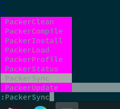

然后就可以看到插件的正常安装:
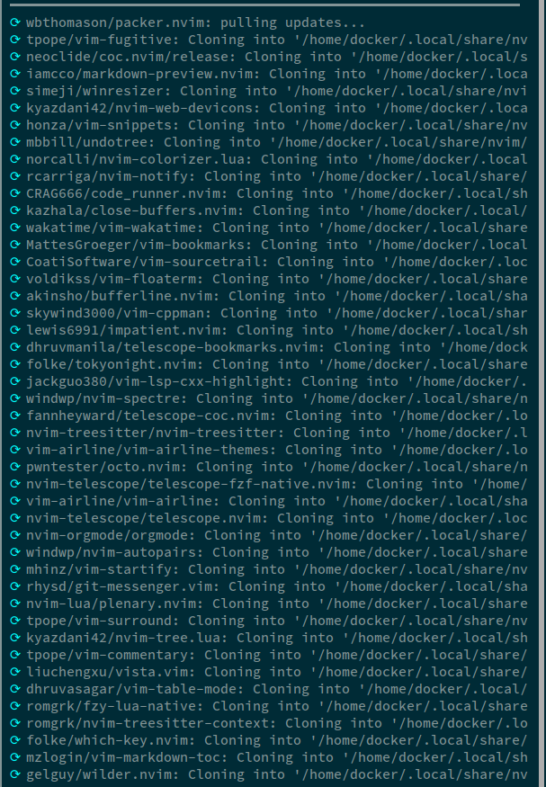

[wakatime](https://wakatime.com/settings/account) 需要输入 api key
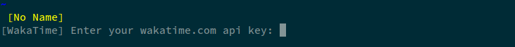
当然如果你不想用这个时间统计插件，可以在 ./lua/plugins.lua 中将其删除。

再次打开之后，coc 的各种插件会自动安装:
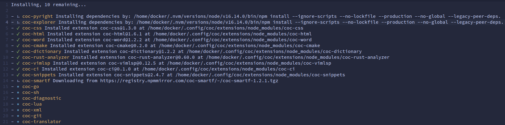

#### checkhealth 检查
在 nvim 中间执行 `checkhealth` 命令，其会提醒需要安装的各种依赖, 比如 xclip 没有安装，那么和系统的 clipboard 和 vim 的 clipboard 之间复制会出现问题。neovim 的 python 的没有安装可能导致一些插件不可用。

例如下面是我的配置的截图。
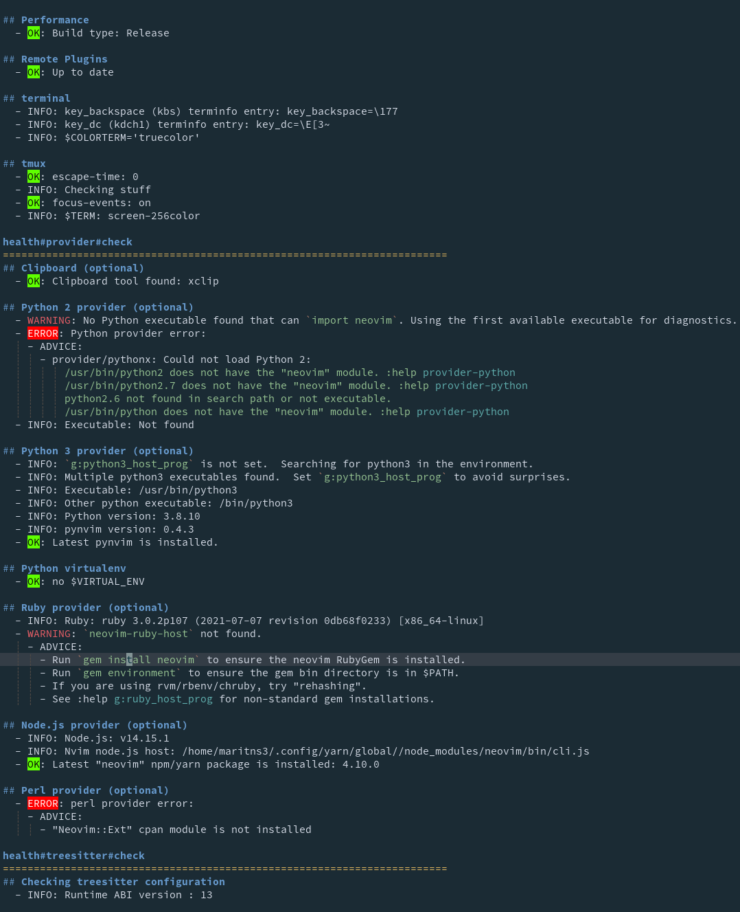

## 升级
本项目之前是基于 SpaceVim 的，之后移除了，如果想要升级，除了 `git pull origin master` 之外
需要操作一遍 [安装本配置](#安装本配置)。

## 基本操作
基本操作是所有人都需要的比如，`h` `j` `k` `l` `e` `w` `b` `g` 等等就不说了。下面说明的内容只是我的常用操作，更多详细的操作请移步到 coc.nvim，ccls 以及特定插件的文档。

三个最核心的 leader 键:

| `<leader>` | `c`           | `<Space>`                         |
|------------|---------------|-----------------------------------|
| 搜索相关   | window 相关的 | 其他的各种操作使用 space 作为开始 |

其中 `<leader>` 被映射为 `,`
```c
let g:mapleader = ','
```

快捷键的配置使用 [which-key.nvim](https://github.com/folke/which-key.nvim)，当按下 `,` 之后，经过 `timeoutlen` 之后，
就会出现弹出下面的窗口显示进一步的使用:
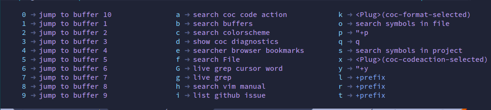

#### 退出
虽然我使用了很长时间的 vim，但是两个东西我依旧觉得非常坑，那就是退出和复制。关于 vim 如何退出，闹出很多笑话，比如有人创建一个[仓库](https://github.com/hakluke/how-to-exit-vim)用于收集各种退出的方法。stackoverflow 的报告说，其帮助了一百万人次如何退出 vim 。

1. 使用命令 `:q` 可以退出一个窗口，这个命令被映射为 `q`。
2. 我使用命令 `:xa` 退出 vim。 `x` 表示保存并且关闭 buffer，`a`表示运用于所有的。这个命令被在配置中被映射为 `<space>` `q` 了。

#### 复制粘贴
关于剪切板，可以 `:h registers`

> 8. Selection registers `"*` and `"+`
> Use these registers for storing and retrieving the selected text for the GUI.
> See |quotestar| and |quoteplus|.  When the clipboard is not available or not
> working, the unnamed register is used instead.  For Unix systems and Mac OS X,
> see |primary-selection|.

简而言之，就是 vim 存在很多剪切板，当在浏览器中复制的内容，实际上被存放到了 `+` 这个 register 中了，
为了粘贴到 vim 中，就需要使用 `"` `+` `p` 了，为了加快这个操作，可以重新映射一些键位。

```vim
map <leader>y "+y
map <leader>p "+p
map <leader>d "+d
```

`,` `y` 和 `,` `p` 实现复制粘贴，`,` `d` 删除到系统剪切板中。
#### 符号搜索
利用 [telescope](https://github.com/nvim-telescope) 快速搜索 file，buffer，function 等

| key binding | function                 |
|-------------|--------------------------|
| `,` `o`     | 在当前文件中间搜索该符号 |
| `,` `s`     | 整个工程中间搜索该符号   |

在 fork.c 中间搜索 `_x64_sys_fork` 这个符号:
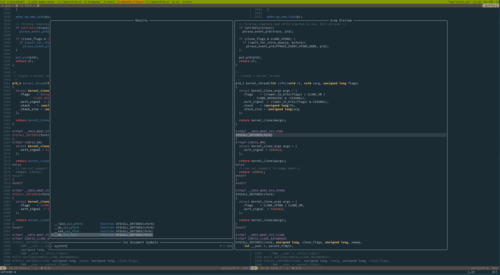

在整个 Linux 工程中间搜索 sysclone 这个符号:
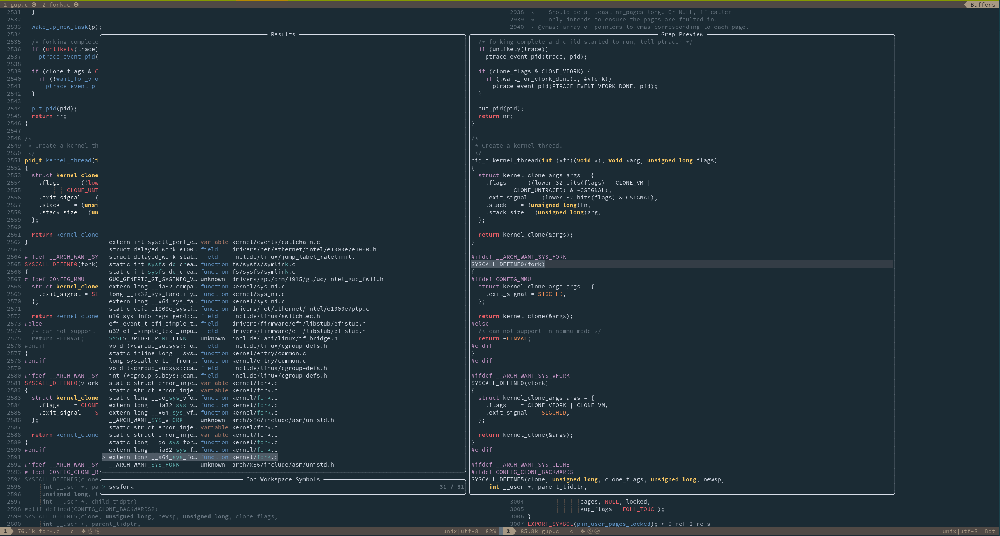

#### 定义和引用

| key binding | function                                                                      |
|-------------|-------------------------------------------------------------------------------|
| `g` `d`     | 跳转到定义                                                                    |
| `g` `r`     | 当只有一个 ref 的时候，直接跳转，当存在多个的时候，显示如下窗口，可以逐个选择 |

#### 注释

| key binding | function                                             |
|-------------|------------------------------------------------------|
| `K`         | 可以查询函数，变量，宏等，注释将会显示在悬浮窗口上。 |

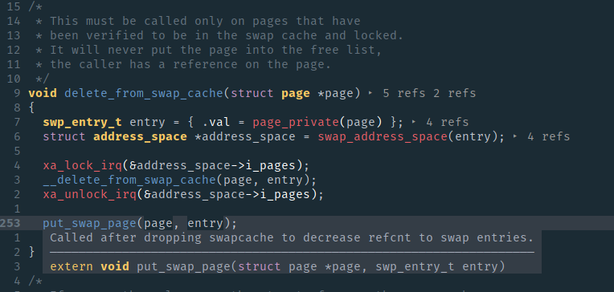

#### 格式化

| key binding         | function                                         |
|---------------------|--------------------------------------------------|
| `<space>` `l`  `r` | 格式化当前文件，支持 C/C++ , Rust 和 Python 等。 |

可以通过一个工程的目录下的 `.clang-format` 来实现配置 C/C++ 的格式样式:
1. https://github.com/MaskRay/ccls/blob/master/.clang-format : 将代码格式为 LLVM 风格
2. https://github.com/torvalds/linux/blob/master/.clang-format : 代码格式为 linux kernel 风格

#### 重命名
有时候，写了一个函数名，然后多次调用，最后发现函数名的单词写错了，一个个的修改非常的让人窒息。使用 `<space>` `l` `r` 在需要重命名的元素上，即可批量重命名。

#### 字符串搜索

| key binding      | function                                        |
|------------------|-------------------------------------------------|
| `leader` `s` `p` | 在整个工程中搜索替换该字符串                    |
| `leader` `s` `P` | 在整个工程中搜索替换**对于光标所在**字符串      |
| `leader` `g`     | 实时动态搜索(grep on the fly)                   |
| `leader` `G`     | 实时动态搜索(grep on the fly)**光标所在**字符串 |

#### file tree

| key binding     | function                                              |
|-----------------|-------------------------------------------------------|
| `space` `f` `o` | 将当前的文件显示在 filetree 中间                      |
| `space` `f` `t` | 打开关闭文件树                                        |
| `r`             | 相当于 shell 中间的 mv 命令，实现文件的重命名或者移动 |
| `d`             | 删除                                                  |
| `j`             | 向下移动                                              |
| `k`             | 向上移动                                              |
| `h`             | 移动到上一个目录                                      |
| `l`             | 打开目录或者文档                                      |
| `a`             | 创建文件(如果输入的名称结尾有 / ，那么就是创建文件夹) |

#### window
因为 window leader 键位被我重新映射为 `c`

| key binding | function       |
|-------------|----------------|
| `<Tab>`     | 进入下一个窗口 |
| `c` `g`     | 水平拆分窗口   |
| `c` `v`     | 垂直拆分窗口   |
| `q`         | 关闭窗口       |
| `c` `m`     | 当前窗口最大化 |

#### buffer

| key binding       | function                                                                  |
|-------------------|---------------------------------------------------------------------------|
| `,` `b`           | 搜索 buffer，前面提到过的，这个主要用于打开的 buffer 的数量非常多的情况下 |
| `,` num           | 切换当前窗口到第 num 个 buffer                                            |
| `<Space>` `b` `c` | 关闭其他已经保存的 buffer                                                 |
| `<Space>` `b` `d` | 关闭当前 buffer                                                           |

#### 导航
1. telescope 同样可以用于搜索文件使用 `,` `f` + 文件名, 同样的，搜索 buffer 的方法类似 : `,` `b` + buffer 名称。
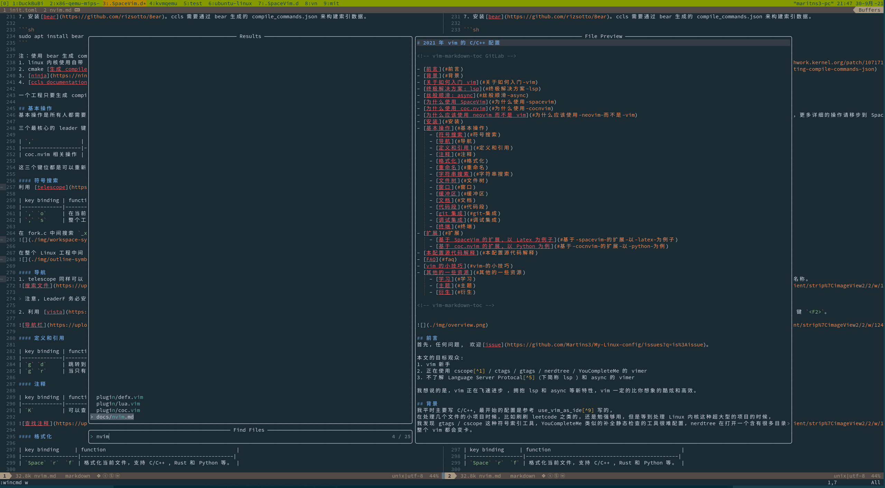

2. 利用 [vista](https://github.com/liuchengxu/vista.vim) 实现函数侧边栏导航(类似于 tagbar) ，打开关闭的快捷键 `c` `n`。
use 'navarasu/onedark.nvim'
<p align="center">
  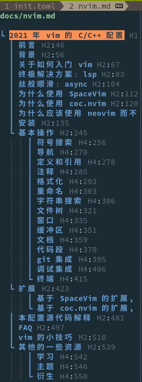
</p>


#### 文档
在需要查询的函数上 : `Ctrl` `]`，相关文档将会显示在窗口上方。使用本功能需要安装[cppman](https://github.com/aitjcize/cppman) 以及缓存文档。
```sh
pip install cppman
cppman -c
```


和`查找注释`的功能区别在于，`K`是找到该函数的定义，然后显示函数或者变量"附近"(函数上方或者变量右侧的注释)，而查找文档是从 http://cplusplus.com/ 和 http://cppreference.com/ 中间获取文档。

#### 代码段
基于[UltiSnips](https://github.com/SirVer/ultisnips/blob/master/doc/UltiSnips.txt) 可以自己向 UltiSnips/c.snippets，UltiSnips/cpp.snippets 中间添加 C/C++ 的自己定义代码段。 以前刷 OJ 的时候每次都不知道要加入什么头文件，然后就写了一个自定义 snippet，一键加入所有常用的头文件。

```snippets
snippet import
#include <iostream>
// 省略部分头文件，具体内容在下方的截图中间
#include <unordered_map>

using namespace std;

int main(){
  ${0}
  return 0;
}
endsnippet
```

这样，然后每次只需要输入 import 这些内容就自动出现了，效果如下。
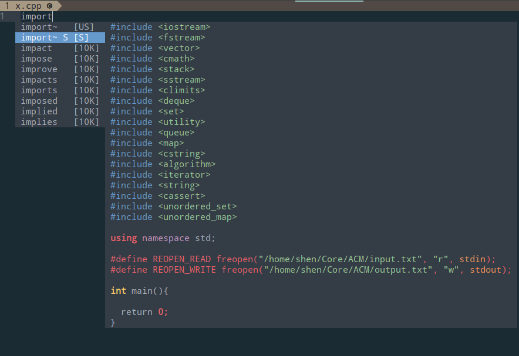

#### 自动补全
自动补全是自动触发的，coc.nvim 无需另外的配置，效果如下。
<p align="center">
  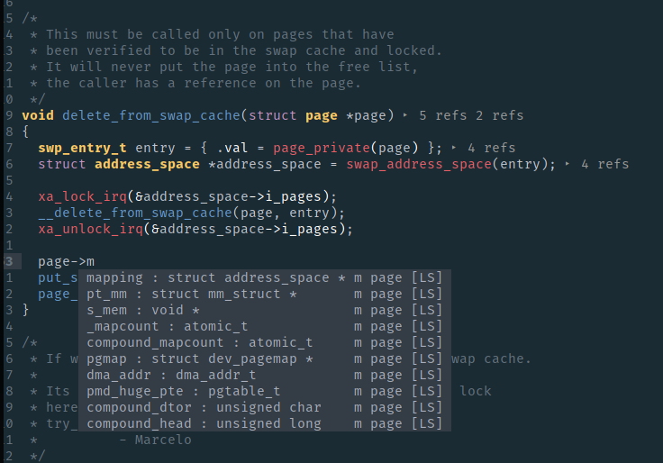
</p>

使用 `tab` 来确认选择，使用 `Crtl` `n` 和 `Ctrl` `p` 来移动。
#### git 集成
包含了一些 git 常见操作，快捷键都是 `<Space>` `g` 开始的，当然 git 本身就是一个非常复杂的工具，主要使用三个工具:
1. [tig](https://github.com/jonas/tig)，利用 [floaterm](https://github.com/voldikss/vim-floaterm)，在 vim 中间运行。
2. [GitMessenger](https://github.com/voldikss/vim-floaterm)可以显示所在行的 git blame 信息。
3. [vim-fugitive](https://github.com/tpope/vim-fugitive) : 查看每一行的 blame, 提交代码等

#### github 集成
通过 [github cli](https://github.com/cli/cli) 可以在终端上操作 github 上的 issue / pull request 等，
而通过 [octo.nvim](https://github.com/pwntester/octo.nvim) 可以将 github 进一步继承到 nvim 中。

1. 安装 github cli 参考[这里](https://github.com/cli/cli/blob/trunk/docs/install_linux.md)
2. 使用方法参考 octo.nvim 的 README.md

例如可以直接查看本项目中的 issue
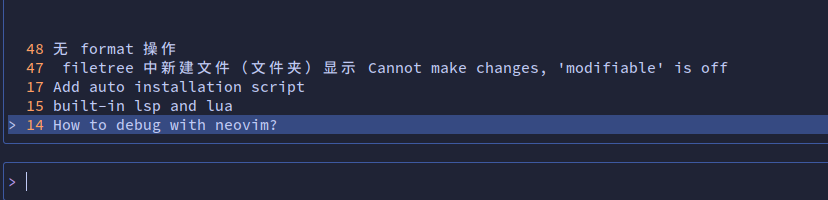

#### 调试集成
现在还没有很好的方法实现调试继承。我个人平时使用下面两个项目辅助 gdb 的使用:
1. https://github.com/cyrus-and/gdb-dashboard
2. https://www.gdbgui.com/

更多的参考 : https://scattered-thoughts.net/writing/the-state-of-linux-debuggers/

如果恰好用的是 rust, 可以参考: https://github.com/simrat39/rust-tools.nvim

#### vim cmdline
通过 [wilder.nvim](https://github.com/gelguy/wilder.nvim) 可以让 vim cmdline 实现模糊搜索。

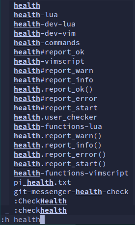
#### 终端
利用 `voidkiss/floaterm` 可以实现将终端以 float window 的形式打开，映射的快捷键分别为:
- `Ctrl` `n` : 创建新的 terminal window
- `Ctrl` `p` : 切换到 `prev` 的 terminal window
- `Ctrl` `t` : 显示/隐藏窗口

下面是在打开悬浮终端，并且运行 htop 的结果:


#### 一键运行代码
在 VSCode 中有一个非常有名的插件叫 [Code Runner](https://marketplace.visualstudio.com/items?itemName=formulahendry.code-runner)

vim 中利用 [code_runner.nvim](https://github.com/CRAG666/code_runner.nvim) 可以实现类似的功能。

| binding           | function                 |
|-------------------|--------------------------|
| `<space>` `l` `r` | 根据文件类型，执行该文件 |

例如对于 C 语言项目，从上到下三个箭头分别指向:
- 源代码
- 运行结果
- 运行使用的命令
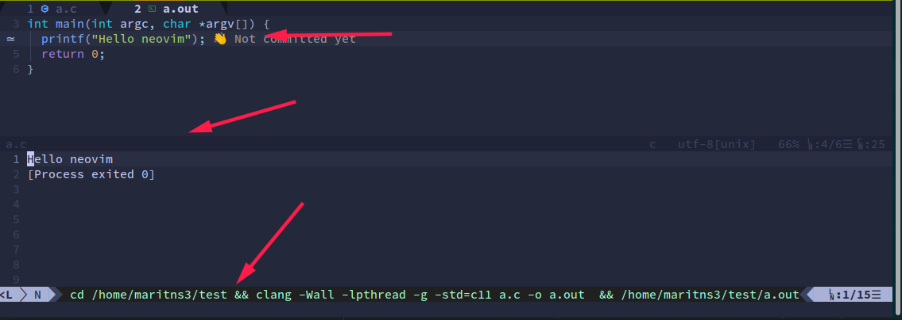

#### 一键注释代码

| binding           | function                         |
|-------------------|----------------------------------|
| `<space>` `l` `c` | 根据文件类型，自动注释选中的区间 |

#### markdown 集成

| binding           | function             |
|-------------------|----------------------|
| `<space>` `t` `m` | 开启表格快捷编辑模式 |
| `<space>` `l` `r` | 预览                 |

## 本配置源代码解释
总体来说，本配置的代码就是从上面介绍的各个项目提供的标准配置的组合，然后添加我的一些微调。

本配置的主要组成:
- init.vim : vim 的基础选项
- vim
  - coc.vim : coc.nvim 和 ccls 的配置，几乎是[coc.nvim 标准配置](https://github.com/neoclide/coc.nvim#example-vim-configuration) 和 [ccls 提供给 coc.nvim 的标准配置](https://github.com/MaskRay/ccls/wiki/coc.nvim) 的复制粘贴。
  - coc-config.vim : coc.nvim 对于插件的配置
  - ccls.vim : ccls 增加的一些快捷键
  - debug.vim : 定义了两个函数
- lua
  - plugins.lua : 安装的插件，按照作用放到一起，每一个插件是做什么的都有注释。
  - whichkey-config.lua : 快捷键的配置
  - tree-config.lua / orgmode-config.lua / ... : 各种插件的默认配置的调整，都非常短

## FAQ
- 为什么不使用 IDE，比如 [CLion](https://www.jetbrains.com/clion/)?
    - 恰恰相反，我反对新手一开始就折腾 vim ，刚开始学编程，CLion 我认为是最好的 IDE 。[Code::Blocks](https://www.codeblocks.org/) 过于陈旧，[Visual Studio](https://visualstudio.microsoft.com/zh-hans/) 是 Windows 平台独占。而 CLion 保持了 jetbrains 的一贯高水平，简单易用，不要需要掌握太多 gcc 工具链的知识，只要点击一下 绿色的小三角就可以运行代码，而且使用校园邮箱是可以申请免费使用的。 但是，对于老司机，IDE 提供了太多了太多我们不需要的功能，可定制太差，如果我同时想要写多门语言，那么就要同时购买多个 IDE 。
    - 我认为当你掌握了一门语言，比如 C 语言，可以写超过千行的项目的时候，是入手的好时间。
- 为什么不使用 VSCode ?
    - VSCode 比 Sublime 功能更强，比 [Atom](https://atom.io/) 性能更高，而且 VSCode 内部是可以继承 vim 的。VSCode 因为是基于 electron 的，甚至可以在一个 window 编辑 markdown, 一个 window 实时预览 markdown 。但是 vim 可以更加简洁, 灵活和高效。
    - VSCode 的功能非常强大，几乎发
- 我应该使用这个配置吗 ?
    - 我认为仓库的意义是让大家使用上 vim 新特性，其实还有很多的其他的配置也非常不错，但是一些常年没有更新，以及使用老旧插件的配置就不用看。比如 use_vim_as_ide, [exvim](https://exvim.github.io/), [spf13-vim](https://github.com/spf13/spf13-vim), [The Ultimate vimrc](https://github.com/amix/vimrc) 之类的。
- 为什么不使用 built-in lsp?
    - 首先，我强烈推荐推荐你看看 [NvChad](https://github.com/NvChad/NvChad) 这个项目。
    - 总体来说，lua 和 built-in 的很多事情正在被折腾中，很多东西更新很快，变化很快，意味着很多坑需要踩。
    - 其实很多插件已经开始只提供 lua 的配置方法了，相关的资料暂时收藏到[这里](https://github.com/Martins3/My-Linux-config/issues/15)
    - built-in lsp 相对于 coc.nvim 不具有明显的优势，所以不会到时候将其切换掉的打算。
    - fannheyward 的 [Thoughts on coc.nvim](https://fann.im/blog/2021/08/01/thoughts-on-coc.nvim/) 分析地很深刻
- 支持什么操作系统和架构?
    - 支持 Windows 需要少量的调整。
    - 对于 x86 Linux / Mac 完整的支持。
    - [龙芯架构 Linux](https://martins3.github.io/loongarch/neovim.html) 基本支持。

## vim 的小技巧
- 翻滚屏幕

| key binding | function                               |
|-------------|----------------------------------------|
| H           | 保持屏幕内容不动, 移动到屏幕最上方     |
| M           | 保持屏幕内容不动, 移动到屏幕中间       |
| L           | 保持屏幕内容不动, 移动到屏幕最下面     |
| zt          | 将当前行移动到屏幕最上方               |
| zz          | 将当前行移动到屏幕中间                 |
| zb          | 将当前行移动到屏幕最下方               |
| Ctrl + f    | 向前滚动一屏，但是光标在顶部           |
| Ctrl + d    | 向前滚动一屏，光标在屏幕的位置保持不变 |
| Ctrl + b    | 向后滚动一屏，但是光标在底部           |
| Ctrl + u    | 向后滚动半屏，光标在屏幕的位置保持不变 |
| Ctrl + e    | 向上滚动                               |
| Ctrl + y    | 向下滚动                               |

- vim 下的 Man 命令打开的 manual 是带高亮和符号跳转的，比在终端中间直接使用 man 好多了
- 在最后一行添加相同的字符 `Ctrl + v` `$` `A` `string appended`，[参考](https://stackoverflow.com/questions/594448/how-can-i-add-a-string-to-the-end-of-each-line-in-vim)。
- 在 Esc 是 vim 中间使用频率非常高的键位，为了不让自己的左手小拇指被拉长，可以将 CapsLock 键映射为 Esc 键，一种修改方法为在 ~/.profile 中加入。这个方法存在一个小问题，就是需要打开一个终端窗口才可以加载这个，应为 .profile 在 login 的时候才会被执行一次。
```txt
setxkbmap -option caps:swapescape
```
- `CTRL-o` 和 `CTRL-i` 跳转的位置的回溯
- `g;` 跳转到刚刚编辑的位置
- `gi` 跳转到刚刚编辑的位置，并且进入到插入模式
- `gf` 打开当前文件
- `{` `}` 分别向上向下跳转到空行
- `%` 跳转到包围的 ([{}]) 或者在匹配的 #if, #ifdef, #else, #elif, #endif 之间跳转
- `:w !sudo tee %` 来保存一个 readonly 文件
- `:g/pattern/command` 可以用于对于匹配的模式操作
  - `:g!/pattern/command` 对于不匹配的操作
- `?` 是向后搜索，`/` 是向前搜索
- `:put =range(1, 10)` 插入 1 到 10 的数值
- 对于选中的 virtual block `S` `str` 可以在 virtual block 两侧添加 `str`. ([ref](https://github.com/tpope/vim-surround/issues/220))

参考:
- [https://thevaluable.dev/vim-advanced/](https://thevaluable.dev/vim-advanced/)

## 调试 vim 配置
有时候，有的 vim 插件会出现问题，为了更好的排除不是其他的配置导致的，可以创建一个最简环境。
参考[这个脚本](https://gist.github.com/kristijanhusak/a0cb5f4eb2bad3e732a1d18d311ebe2f)

## Changelog

### 2022
本配置之前一直是基于 [spacevim](https://spacevim.org/) spacevim 的，移除的原因主要是因为:
- spacevim 的配置很多都是 vimscript 写的，我几乎看不懂，出现了问题无法快速独立解决
- spacevim 为了兼容 vim，一些插件的选择和我有冲突，比如包管理器(dein.vim -> packer.nvim) 和文件树(defx -> nvim-tree)

## 值得一看的配置
- [kickstart.nvim](https://github.com/nvim-lua/kickstart.nvim) 只有 300 行的配置
- [jdhao/nvim-config](https://github.com/jdhao/nvim-config) : jdhao 的配置

## 值得关注的插件
- [nlua](https://github.com/tjdevries/nlua.nvim) neovim 开发 lua 插件环境
- [nvim-gps](https://github.com/SmiteshP/nvim-gps) 在 statusline 中显示当前的函数
- [present.nvim](https://github.com/Chaitanyabsprip/present.nvim): 在 nvim 放播放 ppt
- [heirline](https://github.com/rebelot/heirline.nvim): 简洁高效的 statusline
- [解决中文输入法](https://github.com/h-hg/fcitx.nvim)

## blog
- [和 latex 配合使用](https://damrah.netlify.app/post/note-taking-with-latex-part-1/)
- [awesome neovim](https://github.com/rockerBOO/awesome-neovim)

## 学习
1. [neovimcraft](https://neovimcraft.com/) : neovim 插件教程学习导航网站
2. [vim galore](https://github.com/mhinz/vim-galore)
3. [devhints](https://devhints.io/vimscript) : 另一个 vim checksheet

## 主题
1. [dracula](https://draculatheme.com/vim/) 目前感觉最好看的主题之一
2. [vimcolors](http://vimcolors.com/) vim 主题网站

## 衍生
1. [vim cube](https://github.com/oakes/vim_cubed) : 让 vim 在三维中显示
2. [vim.wasm](https://github.com/rhysd/vim.wasm) : 在 vim 在网页中间使用
3. [neovide](https://github.com/Kethku/neovide) : 一个酷炫的 GUI 客户端
4. [vimium-c](https://github.com/gdh1995/vimium-c) : 在浏览器中使用 vim 快捷键 :star:

[^1]: https://www.reddit.com/r/neovim/comments/p3ji6d/nvimlspconfig_or_cocnvim/
[^7]: [stack overflow helping one million developers exit vim](https://stackoverflow.blog/2017/05/23/stack-overflow-helping-one-million-developers-exit-vim/)
[^8]: [what is the purpose of swap files](https://vi.stackexchange.com/questions/177/what-is-the-purpose-of-swap-files)

<script src="https://utteranc.es/client.js" repo="Martins3/My-Linux-Config" issue-term="url" theme="github-light" crossorigin="anonymous" async> </script>
**转发 CSDN 按侵权追究法律责任，其它情况随意。**
