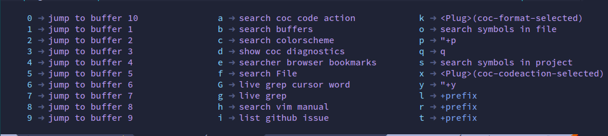
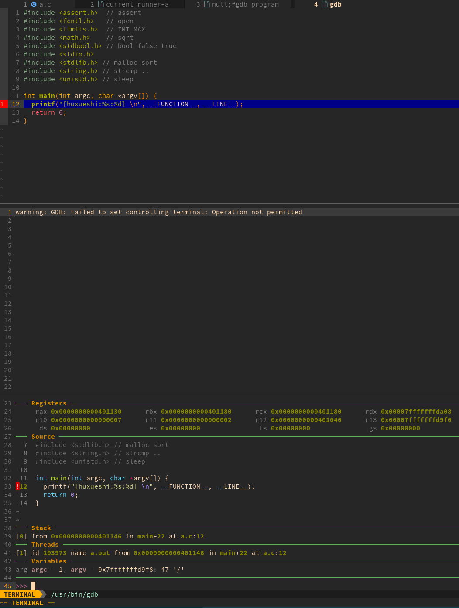

# 2024 年 vim 的 C/C++ 配置

<!-- vim-markdown-toc GitLab -->

* [前言](#前言)
* [入门 vim](#入门-vim)
* [Language Server Protocal](#language-server-protocal)
* [Async](#async)
* [Treesitter](#treesitter)
* [为什么我不再使用 coc.nvim](#为什么我不再使用-cocnvim)
* [为什么应该使用 neovim 而不是 vim](#为什么应该使用-neovim-而不是-vim)
* [安装](#安装)
  * [终端代理](#终端代理)
  * [git 代理](#git-代理)
  * [安装各种依赖](#安装各种依赖)
  * [安装 nvim](#安装-nvim)
  * [安装 nerdfonts](#安装-nerdfonts)
  * [安装 bear](#安装-bear)
  * [安装各种 lsp](#安装各种-lsp)
  * [安装本配置](#安装本配置)
  * [手动编译一些插件](#手动编译一些插件)
  * [checkhealth 检查](#checkhealth-检查)
* [基本操作](#基本操作)
  * [退出](#退出)
  * [复制粘贴](#复制粘贴)
    * [从远程 server 上复制粘贴本地的剪切板中](#从远程-server-上复制粘贴本地的剪切板中)
  * [符号搜索](#符号搜索)
  * [定义和引用](#定义和引用)
  * [注释](#注释)
  * [格式化](#格式化)
  * [重命名](#重命名)
  * [字符串搜索和替换](#字符串搜索和替换)
  * [file tree](#file-tree)
  * [window](#window)
    * [window resize](#window-resize)
  * [buffer](#buffer)
  * [文件搜索](#文件搜索)
  * [导航](#导航)
  * [代码段](#代码段)
  * [代码补全](#代码补全)
  * [Git 集成](#git-集成)
  * [Github 集成](#github-集成)
  * [调试](#调试)
  * [vim cmdline 自动补全](#vim-cmdline-自动补全)
  * [终端](#终端)
  * [一键运行代码](#一键运行代码)
  * [一键注释代码](#一键注释代码)
  * [markdown 集成](#markdown-集成)
  * [Session](#session)
  * [快速移动](#快速移动)
* [本配置源代码解释](#本配置源代码解释)
* [FAQ](#faq)
* [vim 的小技巧](#vim-的小技巧)
* [值得一看的配置](#值得一看的配置)
* [值得关注的插件](#值得关注的插件)
* [有趣的插件](#有趣的插件)
* [学习](#学习)
* [找资源](#找资源)
* [高级话题](#高级话题)
* [衍生](#衍生)

<!-- vim-markdown-toc -->

| 整体效果                         |
| -------------------------------- |
|  |

## 前言

<blockquote class="twitter-tweet"><p lang="zh" dir="ltr">有些看似不起眼的“小工具”或“小技巧”，实质上可以强烈影响到你的工作效率或开发理念，强到你的职业生涯甚至可以拿它当分界线，分为泾渭分明的两块：“学会 XXX 前” vs “学会 XXX 之后”。<br><br>对我来说，“tmux”、“VIM”、“写好的单元测试”、“完全使用英文搜索技术问题”均属于此类。</p>&mdash; piglei (@Piglei) <a href="https://twitter.com/Piglei/status/1501389100074500098?ref_src=twsrc%5Etfw">March 9, 2022</a></blockquote> <script async src="https://platform.twitter.com/widgets.js" charset="utf-8"></script>

本文的目标观众:

1. vim 新手
2. 正在使用 [cscope](http://cscope.sourceforge.net/) / [ctags](https://github.com/universal-ctags/ctags) / [gtags](https://github.com/SpaceVim/SpaceVim/issues/4389) / [nerdtree](https://github.com/preservim/nerdtree) / [YCM](https://github.com/ycm-core/YouCompleteMe) 的 vimer
3. 不了解 [Language Server Protocal](https://microsoft.github.io/language-server-protocol/) (下简称 lsp ) 等新特性的 vimer
4. 没有使用过 [Treesitter](https://github.com/nvim-treesitter/nvim-treesitter)

本项目不是在于要大家使用我的这个配置，而是让大家知道 vim 正在飞速进步 ，拥抱 lsp, async, treesitter 等新特性，vim 一定的比你想象的酷炫。

任何问题, 欢迎[issue](https://github.com/Martins3/My-Linux-config/issues?q=is%3Aissue)。

## 入门 vim

其实关于 vim 的基本知识教程有很多，这里我推荐两个网站

1. [OpenVim](https://openvim.com): 交互式的学习 vim
2. [vim check sheet](https://vim.rtorr.com/lang/zh_cn): vim 常用快捷键清单

如果完全没有基础，建议使用 openvim 打牢基础之后，然后就直接将 vim 用于实战中间，因为这些快捷键都是肌肉记忆，无非多熟悉一下而已。当你知道 hjkl 之类的操作之后，之后可以
使用 vim check sheet 来强化补充一下，不要指望一次全部背下来，也没有必要全部记住，一次学几个，学最能提高你工作效率的那几个。

vim 的学习曲线陡峭主要就是在最开始的 hjkl 这些快捷键的记忆，但是最多几天，之后就学习曲线就非常平缓了，无非是装装插件，重新映射一下快捷键之类的事情。实不相瞒，我用 vim 好几年，至今不会写超过 5 行的 vimscript 。

## Language Server Protocal

lsp 是微软开发 VSCode 提出的，其定义了一套标准编辑器和 language server 之间的规范。

1. 不同的语言需要不同的 Language Server，比如 C/C++ 需要 [clangd](https://clangd.llvm.org/), Rust 语言采用 [rust analyzer](https://github.com/rust-analyzer/rust-analyzer), 官方列举了很多 [lsp servers](https://microsoft.github.io/language-server-protocol/implementors/servers/)。
2. 不同的编辑按照 lsp 的规范和 language server 通信

他们大致的关系如下, 通过统一的接口，大大的减少了重复开发，lsp 定义的查找引用，定义，格式化代码功能只需要安装对应的 language server 支持就是开箱即用，再也无需从各种插件哪里东拼西凑这些功能。

```txt
+------------------------+    +---------------+
|      Editor            |    |Language Server|
+------------------------+    +---------------+
|     Emacs              |    |               |
|     Neovim             +--> |      clangd   |
|     Visual Studio Code |    |               |
+------------------------+    +---------------+
```

## Async

async 的效果当然就是快，当一个插件存在其 async 的版本，那么毫无疑问，就应该使用 async 版本。

文件树插件，我之前一直都是使用 nerdtree 的，直到有一天我用 vim 打开 Linux kernel，我发现光标移动都非常的困难，我开始以为是终端的性能问题，但是在 htop 中发现 vim 的 CPU 利用率很高，
直到将 nerdtree 替换为 [nvim-tree](https://github.com/kyazdani42/nvim-tree.lua) 之类的

关于 nerdtree 为什么不支持 async 可以参考 [why nerdtree doesn't support async](https://github.com/preservim/nerdtree/issues/1170)。

## Treesitter

[treesitter](https://github.com/tree-sitter/tree-sitter) 通过语法分析，而不是词法分析，这让很多事情都非常精确。

1. 更加的智能和高效的高亮。原始的 vim 中只能按照正则匹配来高亮关键字，但是 treesitter 可以区分什么是函数，成员，类，宏等定义。
2. 如果想要跳转到函数头，在 vim 中使用默认提供 [`[``m`](https://stackoverflow.com/questions/2109503/how-to-jump-to-the-beginning-of-the-current-function-body-in-vim)，但是这是根据词法规则实现的，要么跳转到第一个匹配的 { ，要么跳转到最外层的 { ，因此
   对于文件的格式有要求，但是如果使用上 [nvim-treesitter-textobjects](https://github.com/nvim-treesitter/nvim-treesitter-textobjects)，这个问题就不存在了，你总是可以跳转到函数的开始位置。
3. 精确的拼写检查。[spellsitter](https://www.reddit.com/r/neovim/comments/x7k7r7/spellsitter_merged_to_neovim_core/) 可以让拼写检查仅仅检查注释中内容，而默认的检查会检查所有的单词，包括各种缩写函数名，那些检查大部分都是误报。

通过 Treesitter ，[有的插件](https://github.com/ThePrimeagen/refactoring.nvim)可以做到超乎想象的事情，甚至是将《重构，改善既有代码》的操作集成到 vim 中。

## 为什么我不再使用 coc.nvim

最开始的时候，vim / neovim 都是没有内置 lsp 功能的，在 vim 下想要使用 lsp 就要靠 [coc.nim](https://github.com/neoclide/coc.nvim) 这种插件，类似的工具官方列举了很多 [lsp tools](https://microsoft.github.io/language-server-protocol/implementors/tools/),
coc.nvim 的宗旨就是*full language server protocol support as VSCode*, 虽然后来 neovim 内置了，但是到目前为止，我还是认为内置的 lsp 和 coc.nvim 的完善度还是存在一些差距。
reddit 上的一些老哥目前[认为 coc.nvim 的自动补全做的更好，开箱即用。](https://www.reddit.com/r/neovim/comments/p3ji6d/nvimlspconfig_or_cocnvim/)

但是到了 2023 年，虽然我认为 fannheyward 的 [Thoughts on coc.nvim](https://fann.im/blog/2021/08/01/thoughts-on-coc.nvim/) 分析地很深刻，但是现在 native lsp 的易用程度和 coc.nvim 已经很小了，[但是社区的人几乎都倒向了 native lsp](https://www.reddit.com/r/neovim/comments/14pvyo4/why_is_nobody_using_coc_anymore/)。
虽然充满了不舍，但是还是从 coc.nvim 切换为 native lsp 了。对于使用上来说，几乎没有区别，只是现在配置内容变复杂了很多 :( 。

当然，也可能我端午节的时候太清闲了。

## 为什么应该使用 neovim 而不是 vim

其实 vim 还有一个祖先叫做 vi, vim 全称为 vi improve, 但是 vim 在很长一段时间更新的不大，neovim 的作者提交了一个很大的 patch 给 vim，但是被 vim 的作者拒绝了，
因为这个 patch 太大了，改动太多，然后 neovim 的作者就开始自立门户搞了一个 neovim，很多 vim 特性都是被 neovim 逼出来的，
[neovim 推出之后，vim 的更新速度大大加快了](https://www.contextualize.ai/mpereira/20-years-of-vim-ef9acae9)
总体来说，neovim 相较于 vim :

1. 更新更快, 添加的新功能更多，例如内置 lsp, lua 语言的支持。
2. 社区更活跃。这个你对比一下 vim 和 neovim 的开发者数量就可以知道了，vim 很长时间都只有一个人开发的。
3. 很多插件依赖 neovim 新特性，或者只能在 vim 上勉强使用。
4. neovim 支持 lua 语言配置。

根据 stackoverflow 的报告指出 [Neovim is the most loved editor it is the 10th most wanted editor](https://insights.stackoverflow.com/survey/2021#section-most-loved-dreaded-and-wanted-collaboration-tools)

## 安装

安装成功需要注意两点:

1. **代理** : 实现代理的方法在 github 上有很多教程。如果你无法解决**终端**和**git**的代理，这个配置几乎不可能安装成功。
2. 软件版本 : 有的 Linux Distribution 为了稳定性，是锁版本的，例如 Ubuntu，一旦推出 22.04 之后，其上的软件版本几乎都是不变的，这意味着有的软件没有被 apt 收录进去，有的版本太低，这导致有的几个软件需要手动编译。
   当然滚动更新的 Linux Distribution，类似 Arch 或者 Fedora 一般不会存在这些问题。

整个环境的安装主要是 neovim ccls，下面说明一下安装主要步骤以及其需要注意的一些小问题。对于新手，安装过程并不简单，遇到问题多 Google，或者 issue 直接和我讨论。
虽然我自己不用 Ubuntu，考虑到大多数新手使用的是 Ubuntu ，这里给出一个基于 Ubuntu 的安装介绍。

### 终端代理
在执行命令的终端执行如下命令，修改环境代理相关的环境变量:
```sh
export https_proxy=http://10.0.0.2:8889
export http_proxy=http://10.0.0.2:8889
export HTTPS_PROXY=http://10.0.0.2:8889
export HTTP_PROXY=http://10.0.0.2:8889
export ftp_proxy=http://10.0.0.2:8889
export FTP_PROXY=http://10.0.0.2:8889
```
这里的 10.0.0.2 和 8889 是你的代理配置的结果，使用 wget www.google.com 来做测试:
如果配置正常，应该是这样的结果:
```txt
🧀  wget www.google.com
Prepended http:// to 'www.google.com'
--2025-01-06 12:23:06--  http://www.google.com/
Connecting to 10.0.0.2:8889... connected.
Proxy request sent, awaiting response... 200 OK
Length: unspecified [text/html]
Saving to: ‘index.html’

index.html              0  --.-KB/s        index.html         19.39K  --.-KB/s    in 0.06s

2025-01-06 12:23:07 (342 KB/s) - ‘index.html’ saved [19852]
```

### git 代理

在 ~/.gitconfig 中添加如下配置，当 git clone 走 https 的时候，会使用代理。
当然，这里的 10.0.0.2 和 8889 也需要替换为你的代理配置。
```txt
[http]
        proxy = "http://10.0.0.2:8889"

[https]
        proxy = "http://10.0.0.2:8889"

```

### 安装各种依赖

```sh
sudo apt update
# 基本工具
sudo apt install -y gcc wget iputils-ping python3-pip git bear tig shellcheck ripgrep fzf npm yarn

# neovim 的各种依赖 https://github.com/neovim/neovim/wiki/Building-Neovim#build-prerequisites
sudo apt install -y ninja-build gettext libtool libtool-bin autoconf automake cmake g++ pkg-config unzip curl doxygen
```

### 安装 nvim

- 当前配置需要 neovim 0.10 以上的版本，手动安装[参考这里](https://github.com/neovim/neovim/wiki/Installing-Neovim)

其实也就是下面几条命令:

获取到源码，并且 checkout 到最新的 release :
```sh
git clone https://github.com/neovim/neovim && cd neovim
git branch -a
git checkout release-0.10 # 2025-01-06 的最新 release 是 2025
```

编译并且安装:
```sh
make CMAKE_BUILD_TYPE=Release -j16
sudo make install
```

### 安装 nerdfonts
注意，需要修改 terminal 的字体为 nerdfonts 中才不会出现乱码。

nerd-fonts 版本和字体可以到 [releases](https://github.com/ryanoasis/nerd-fonts/releases/) 界面选择

假如需要 FiraCode ，在 Linux 下也就是这几条命令:
```sh
wget https://github.com/ryanoasis/nerd-fonts/releases/download/v3.3.0/FiraCode.zip
unzip FiraCode.zip -d ~/.fonts
fc-cache -fv
```

### 安装 bear

clangd 需要通过 [bear](https://github.com/rizsotto/Bear) 生成的 `compile_commands.json` 来构建索引数据。

```sh
sudo apt install bear
```

注：使用 bear 生成 `compile_commands.json` 是一种通用的方法，但是不同的 build 工具和项目还存在一些捷径可走:

1. linux 内核使用自带的脚本 `scripts/clang-tools/gen_compile_commands.py`，具体可以参考[这里](https://patchwork.kernel.org/patch/10717125/)，这样的话就不用更改一次 .config 就重新编译整个内核。
2. QEMU 项目使用 meson 构建的，其会自动在 build 文件夹中生成 `compile_commands.json`, 直接拷贝到项目的顶层目录就可以了。
3. [cmake](https://stackoverflow.com/questions/23960835/cmake-not-generating-compile-commands-json) 和 [ninja](https://ninja-build.org/manual.html) 都有生成 `compile_commands.json` 的脚本
4. see [ccls documentation](https://github.com/MaskRay/ccls/wiki/Project-Setup) for more

一个工程只要生成 `compile_commands.json`，那么一切就大功告成了。

### 安装各种 lsp

通过 [mason](https://github.com/williamboman/mason.nvim) 可以自动的安装各种 lsp，
在 neovim 中执行 `:Mason` 可以检查各种插件的执行状态。

对于 mason 不支持的 lsp，就需要手动安装了，例如 `sudo apt install ccls`
- [ccls](https://github.com/MaskRay/ccls/wiki/Install)

### 安装本配置

nvim 的配置在 ~/.config/nvim 中，

```sh
mv ~/.config/nvim ~/.config/nvim.bak # 保存原有配置
cd ~ # 保证在根目录下
```

```sh
git clone --depth=1 https://github.com/martins3/My-Linux-config .dotfiles # 随便什么名字
ln -s ~/.dotfiles/nvim ~/.config/nvim # 创建一个软链接指向此处
nvim --headless +qall # 不去打开 nvim 的界面，仅仅显示 nvim 的安装插件的日志
```

然后打开 nvim，nvim 会检查包管理器 lazy.nvim 是否存在，如果不存在，那么首先安装 lazy.nvim ，然后 lazy.nvim 会自动安装所有的插件.

### 手动编译一些插件

一般来说，安装插件是可以自动构建好的，但是我发现有两个插件很多时候并不能，给搭建带来很多困扰，所以可以手动构建

```sh
# markdown-preview.nvim
cd ~/.local/share/nvim/lazy/markdown-preview.nvim/app && npm install
```

### checkhealth 检查

在 nvim 中间执行 `checkhealth` 命令，其会提醒需要安装的各种依赖, **比如 xclip 没有安装，那么和系统的 clipboard 和 vim 的 clipboard 之间复制会出现问题**。neovim 的 python 的没有安装可能导致一些插件不可用。

| 我的配置的截图                      |
| ----------------------------------- |
|  |

## 基本操作

基本操作是所有人都需要的比如，`h` `j` `k` `l` `e` `w` `b` `g` 等等就不说了。下面说明的内容只是我的常用操作，更多详细的操作请移步到 [which-key.lua](../nvim/lua/usr/which-key.lua)对应的插件的文档。

三个最核心的 leader 键:

| `<leader>` | `c`           | `<Space>`                         |
| ---------- | ------------- | --------------------------------- |
| 搜索相关   | window 相关的 | 其他的各种操作使用 space 作为开始 |

其中 `<leader>` 被映射为 `,`

```c
let g:mapleader = ','
```

快捷键的配置使用 [which-key.nvim](https://github.com/folke/which-key.nvim)，

| 当按下 `,` 之后，经过 `timeoutlen` 之后， 弹出下面的窗口显示下一步的按键 |
| ------------------------------------------------------------------------ |
|                                               |

### 退出

虽然我使用了很长时间的 vim，但是两个东西我依旧觉得非常坑，那就是退出和复制。关于 vim 如何退出，闹出很多笑话，比如有人创建一个[仓库](https://github.com/hakluke/how-to-exit-vim)用于收集各种退出的方法。stackoverflow 的报告说，其帮助了一百万人次如何退出 vim 。

1. 使用命令 `:q` 可以退出一个窗口，这个命令被映射为 `q`。
2. 我使用命令 `:xa` 退出 vim。 `x` 表示保存并且关闭 buffer，`a`表示运用于所有的。这个命令被在配置中被映射为 `<space>` `q` 了。

### 复制粘贴

vim 支持多个剪切板，系统剪切板只是 vim 剪切板中的一个

通过 ":h registers" 可以看到 `"*` and `"+` 是对应的系统剪切板

> 8. Selection registers `"*` and `"+`
>    Use these registers for storing and retrieving the selected text for the GUI.
>    See |quotestar| and |quoteplus|. When the clipboard is not available or not
>    working, the unnamed register is used instead. For Unix systems and Mac OS X,
>    see |primary-selection|.

当在浏览器中复制的内容，实际上被存放到了 `+` 这个 register 中了，
为了粘贴到 vim 中，就需要使用 `"` `+` `p` 了，其含义为:
1. `"` : 使用寄存器
2. `+` : 选择系统剪切板这个寄存器
3. `p` : 粘贴

由于本配置使用了 [which-key.nvim](https://github.com/folke/which-key.nvim)，所以可以
在 normal mode 中使用 `"` 或者在 insert mode 中使用 `<C-r>` 来展示 register 的内容。

为了加快这个操作，可以重新映射一些键位。
```vim
map <leader>y "+y
map <leader>p "+p
map <leader>d "+d
```
所以现在可以使用，`,` `y` 和 `,` `p` 实现复制粘贴，`,` `d` 删除到系统剪切板中。

#### 从远程 server 上复制粘贴本地的剪切板中

假如你在一台 windows 系统的电脑中 ssh 到一台 Linux server 上，在 server 中使用复制，默认会复制到 server 的剪切板中。
neovim 在 0.10 中增加了一个新功能 oscyank，通过该功能可以直接复制到你在使用的 windows 电脑的剪切板中。

如果 0.10 之前的版本， 使用插件 [ojroques/vim-oscyank](https://github.com/ojroques/vim-oscyank)

如果是在 tmux 中使用，那么 tmux 中需要添加如下配置:
```txt
# Allow clipboard with OSC-52 work, see https://github.com/tmux/tmux/wiki/Clipboard
set -s set-clipboard on
```

原理上参考:
- https://news.ycombinator.com/item?id=32037489
- https://github.com/ojroques/vim-oscyank/issues/24

### 符号搜索

利用 [telescope](https://github.com/nvim-telescope) 快速搜索 file，buffer，function 等

| key binding | function                 |
| ----------- | ------------------------ |
| `,` `o`     | 在当前文件中间搜索该符号 |
| `,` `s`     | 整个工程中间搜索该符号   |

| 在 fork.c 中间搜索 `_x64_sys_fork` 这个符号 |
| ------------------------------------------- |
|    |

| 在整个 Linux 工程中间搜索 sysclone 这个符号 |
| ------------------------------------------- |
|      |

### 定义和引用

| key binding | function                                                                      |
| ----------- | ----------------------------------------------------------------------------- |
| `g` `d`     | 跳转到定义                                                                    |
| `g` `r`     | 当只有一个 ref 的时候，直接跳转，当存在多个的时候，显示如下窗口，可以逐个选择 |

### 注释

| key binding | function                                             |
| ----------- | ---------------------------------------------------- |
| `K`         | 可以查询函数，变量，宏等，注释将会显示在悬浮窗口上。 |

| 展示 `put_swap_page` 的注释     |
| ------------------------------- |
|  |

### 格式化

| key binding       | function                                         |
| ----------------- | ------------------------------------------------ |
| `<space>` `l` `f` | 格式化当前文件，支持 C/C++ , Rust 和 Python 等。 |

可以通过一个工程的目录下的 `.clang-format` 来实现配置 C/C++ 的格式样式:

1. https://github.com/MaskRay/ccls/blob/master/.clang-format : 将代码格式为 LLVM 风格
2. https://github.com/torvalds/linux/blob/master/.clang-format : 代码格式为 linux kernel 风格

### 重命名

有时候，写了一个函数名，然后多次调用，最后发现函数名的单词写错了，一个个的修改非常的让人窒息。使用 `<space>` `l` `n` 在需要重命名的元素上，即可批量重命名。

### 字符串搜索和替换

vim 内置了强大的搜索替换功能

- `/` `?` 分别向前和向后搜索
- 在 visual block 中可以使用 norm 来进行插入或者使用宏
- 替换的语法 `%s/pattern/replace/g`

上面说明的都是单文件的，通过插件，可以容易的实现多文件的搜索和替换。

| key binding      | function                                        |
| ---------------- | ----------------------------------------------- |
| `leader` `s` `p` | 在整个工程中搜索替换该字符串                    |
| `leader` `s` `P` | 在整个工程中搜索替换**对于光标所在**字符串      |
| `leader` `g`     | 实时动态搜索(grep on the fly)                   |
| `leader` `G`     | 实时动态搜索(grep on the fly)**光标所在**字符串 |

### file tree

| key binding     | function                                              |
| --------------- | ----------------------------------------------------- |
| `space` `f` `o` | 将当前的文件显示在 filetree 中间                      |
| `space` `f` `t` | 打开关闭文件树                                        |
| `r`             | 相当于 shell 中间的 mv 命令，实现文件的重命名或者移动 |
| `d`             | 删除                                                  |
| `j`             | 向下移动                                              |
| `k`             | 向上移动                                              |
| `h`             | 移动到上一个目录                                      |
| `l`             | 打开目录或者文档                                      |
| `a`             | 创建文件(如果输入的名称结尾有 / ，那么就是创建文件夹) |

### window

因为 window leader 键位被我重新映射为 `c`

| key binding | function       |
| ----------- | -------------- |
| `<Tab>`     | 进入下一个窗口 |
| `c` `g`     | 水平拆分窗口   |
| `c` `s`     | 垂直拆分窗口   |
| `q`         | 关闭窗口       |
| `c` `m`     | 当前窗口最大化 |


#### window resize

nvim 提供了原生的命令来自动一个 windows 的大小，例如可以使用 `vertical resize +10`
将增大 10 个单位。如果想要调整多次，那么需要执行多次这个命令:

利用 [nvimtools/hydra.nvim](https://github.com/nvimtools/hydra.nvim) ，可以先
`c` `a` 两个键，进入到调整模式，然后使用 `j` `k` 调整 windows 的大小。


### buffer

| key binding       | function                       |
| ----------------- | ------------------------------ |
| `,` `b`           | 搜索 buffer                    |
| `,` num           | 切换当前窗口到第 num 个 buffer |
| `<Space>` `b` `c` | 关闭其他已经保存的 buffer      |
| `<Space>` `b` `d` | 关闭当前 buffer                |

### 文件搜索

telescope 同样可以用于搜索文件使用 `,` `f` + 文件名

| 文件搜索                             |
| ------------------------------------ |
|  |

### 导航
基于 [lspsaga](https://nvimdev.github.io/lspsaga/outline/)


### 代码段

基于[friendly-snippets](https://github.com/rafamadriz/friendly-snippets/blob/main/snippets/c/c.json) 可以自己向 UltiSnips/c.snippets，
UltiSnips/cpp.snippets 中间添加 C/C++ 的自己定义代码段。
以前刷 OJ 的时候每次都不知道要加入什么头文件，然后就写了一个自定义 snippet，一键加入所有常用的头文件。

```snippets
snippet import
  #include <bits/stdc++.h>
  // #include "../dbg.hpp"
  using namespace std;
  #define REOPEN_READ freopen("/home/maritns3/test/cpp/input.txt", "r", stdin);
  int main(int argc, char *argv[]){https://github.com/rafamadriz/friendly-snippets/blob/main/snippets/c/c.json
    ${0}
  	return 0;
  }
```

| 输入 import 这些内容就自动补全  |
| ------------------------------- |
|  |

### 代码补全

| 代码补全                             |
| ------------------------------------ |
|  |

使用 `enter` 来确认选择，使用 `tab` 选择下一个。

### Git 集成

包含了一些 git 常见操作，快捷键都是 `<Space>` `g` 开始的，当然 git 本身就是一个非常复杂的工具，主要使用三个工具:

1. [tig](https://github.com/jonas/tig)，利用 [floaterm](https://github.com/voldikss/vim-floaterm)，在 vim 中间运行。
2. [GitMessenger](https://github.com/voldikss/vim-floaterm)可以显示所在行的 git blame 信息。
3. [vim-fugitive](https://github.com/tpope/vim-fugitive) : 查看每一行的 blame, 提交代码等

### Github 集成

通过 [github cli](https://github.com/cli/cli) 可以在终端上操作 github 上的 issue / pull request 等，
而通过 [octo.nvim](https://github.com/pwntester/octo.nvim) 可以将 github 进一步继承到 nvim 中。

1. 安装 github cli 参考[这里](https://github.com/cli/cli/blob/trunk/docs/install_linux.md)
2. 使用方法参考 octo.nvim 的 README.md

| 直接查看本项目中的 issue     |
| ---------------------------- |
|  |

### 调试

我一般使用 [gdb-dashboard](https://github.com/cyrus-and/gdb-dashboard)，不使用额外的 vim 配置。

neovim 中有内置调试功能 [Termdebug](https://fzheng.me/2018/05/28/termdebug/)，但是感觉功能比较初级。

| 使用内置的 Termdebug 进行调试 |
| ----------------------------- |
|  |

一种更强大的方法是通过 [nvim-dap](https://github.com/mfussenegger/nvim-dap) 来构建，具体配置参考，我目前兴趣不大:
- https://www.johntobin.ie/blog/debugging_in_neovim_with_nvim-dap/
- https://github.com/microsoft/vscode-cpptools

此外还有插件 [nvim-gdb](https://github.com/sakhnik/nvim-gdb) ，也许可以勉强维持生活。

[gdb-frontend](https://oguzhaneroglu.com/projects/gdb-frontend/) 看上去不错，利用浏览器提供了一个相当精致的界面

但是无论如何，使用 debugger 来找 bug 不是一个好习惯，应该是靠清晰的代码结构和单元测试[^2]。

### vim cmdline 自动补全

通过 [hrsh7th/cmp-cmdline](https://github.com/hrsh7th/cmp-cmdline) 可以让 vim cmdline 实现模糊搜索。

| 利用 在命令模式自动补全                                                                                        |
|----------------------------------------------------------------------------------------------------------------|
|  |

### 终端

利用 `voidkiss/floaterm` 可以实现将终端以 float window 的形式打开，我映射的快捷键分别为:

- `Ctrl` `t` : 显示/隐藏窗口

| 打开悬浮终端，并且运行 htop 的结果 |
| ---------------------------------- |
|    |

关于 `voidkiss/floaterm` 和 `akinsho/toggleterm.nvim` 的对比:

1. voidkiss 的更加稳定，功能更多。但是有严重的性能问题，例如编译内核的过程中，产生的 log 可能导致 nvim 卡死。
2. akinsho 项目更加新，使用 lua 写的，在 UI 上更加灵活，但是存在一些细微的 bug 和功能缺失。

- 终端丢失。
- 切换终端的时候莫名奇妙进入 normal mode
- 如果同时使用多个终端，其管理难度简直逆天。
- 没有简洁的 voidkiss 中 FloatermNew 的功能。
  综上，我认为最近两年没有必要切换。

2024-11-02 ，升级 nvim 0.10.1 之后，FloatermNew 已经不可以用了，所以还是
使用 akinsho/toggleterm.nvim 了

### 一键运行代码

在 VSCode 中有一个非常有名的插件叫 [Code Runner](https://marketplace.visualstudio.com/items?itemName=formulahendry.code-runner)

vim 中利用 [`code_runner.nvim`](https://github.com/CRAG666/code_runner.nvim) 可以实现类似的功能。

| binding           | function                 |
| ----------------- | ------------------------ |
| `<space>` `l` `r` | 根据文件类型，执行该文件 |

| C 语言文件一键运行                  |
| ----------------------------------- |
|  |

从上到下三个箭头分别指向:

- 源代码
- 运行结果
- 运行使用的命令

### 一键注释代码

| binding           | function                         |
| ----------------- | -------------------------------- |
| `<space>` `l` `c` | 根据文件类型，自动注释选中的区间 |

### markdown 集成

| binding           | function             |
| ----------------- | -------------------- |
| `<space>` `t` `m` | 开启表格快捷编辑模式 |
| `<leader>` `x`    | 预览                 |

### Session

在每一个文件夹会自动创建 session，这样当 nvim 重新打开的时候，window 还是上次关闭的样子.

使用命令 SessionDelete 可以删除掉保存的 session 。

如果想要清理所有 sessions 使用如下命令发。

```sh
rm -r ~/.local/share/nvim/sessions
```

### 快速移动

vim 基本的移动技术，例如 e b w G gg 之类的就不说了， 下面简单说明一些有趣的的技术：

在我使用 [ggandor/leap.nvim](https://github.com/ggandor/leap.nvim) 之后，有种全新的体验，跳转到任何位置，之需要按下 `s`，然后连续按下该位置开始的两个字符，
接下来会提示按什么就可以直接跳转到该位置。

| 例子                                                                                            |
| ----------------------------------------------------------------------------------------------- |
|  |

按 s 开始跳转，然后搜索第一个字母 m，会出现三种选择:

- me : 两个都是白色，此时再按 e，那么可以直接跳转到其上
- mes : 需要按 es 才可以，原因是存在多个满足 m?s 形式的字符。
- met : 其 t 被高亮的，直接按 t 就可以了，无需按 s ，因为 met 的三个字母是唯一的。

进行跳转的时候，前两个字符可以直接敲下去，而第三个字符需要看 easy mothion 的设置。

如果想要让自己彻底的移除掉低效移动的坏习惯，还是得靠 [m4xshen/hardtime.nvim](https://github.com/m4xshen/hardtime.nvim)

| binding  | function                                                                    |
| -------- | --------------------------------------------------------------------------- |
| `CTRL-o` | 跳转的位置的回溯                                                            |
| `g;`     | 跳转到刚刚编辑的位置                                                        |
| `gi`     | 跳转到刚刚编辑的位置，并且进入到插入模式                                    |
| `gf`     | 打开光标所在文件                                                            |
| `%`      | 跳转到包围的 ([{}]) 或者在匹配的 #if, #ifdef, #else, #elif, #endif 之间跳转 |

## 本配置源代码解释

总体来说，本配置的代码就是从上面介绍的各个项目提供的标准配置的组合，然后添加我的一些微调。

nvim 配置在仓库的位置为 ./nvim 中，其他的目录不用管，那是关于 vim 其他的配置。

- init.vim : vim 的基础设置，在其中加载 vim/ 和 lua/usr 下的配置文件
- vim/
  - debug.vim : 定义了两个函数
  - misc.vim : 各种插件的细微的修改
- lua/init.lua : 加载其他的 lua 配置
- lua/usr
  - packer.lua : 安装的插件，按照作用放到一起，每一个插件是做什么的都有注释。
  - which-key.lua : 快捷键的配置
  - nvim-tree.lua ... : 一些插件的默认配置的调整，都非常短。
  - lsp : native lsp 相关的配置
- UltiSnips/ : 自定义的代码段，主要是 bash 相关的

## FAQ

- 为什么不使用 IDE，比如 [CLion](https://www.jetbrains.com/clion/)?
  - 恰恰相反，我反对新手一开始就折腾 vim ，刚开始学编程，CLion 我认为是最好的 IDE 。[Code::Blocks](https://www.codeblocks.org/) 过于陈旧，[Visual Studio](https://visualstudio.microsoft.com/zh-hans/) 是 Windows 平台独占。而 CLion 保持了 jetbrains 的一贯高水平，简单易用，不要需要掌握太多 gcc 工具链的知识，只要点击一下 绿色的小三角就可以运行代码，而且使用校园邮箱是可以申请免费使用的。 但是，对于老司机，IDE 提供了太多了太多我们不需要的功能，可定制太差，如果我同时想要写多门语言，那么就要同时购买多个 IDE 。
  - 我认为当你掌握了一门语言，比如 C 语言，可以写超过千行的项目的时候，是入手的好时间。
- 为什么不使用 VS Code ?
  - VS Code 比 Sublime 功能更强，比 [Atom](https://atom.io/) 性能更高，而且 VSCode 可以集成 vim 。因为 VSCode 是基于 electron 的，甚至可以在一个 window 中编辑 markdown, 一个 window 实时预览 markdown 。
  - 但是 vim 可以更加简洁, 灵活和高效。
- 我应该使用这个配置吗 ?
  - 我认为仓库的意义是让大家使用上 vim 新特性，其实还有很多的其他的配置也非常不错，但是一些常年没有更新，以及使用老旧插件的配置就不用看。
  比如 [use_vim_as_ide](https://github.com/yangyangwithgnu/use_vim_as_ide), [exvim](https://exvim.github.io/), [spf13-vim](https://github.com/spf13/spf13-vim), [The Ultimate vimrc](https://github.com/amix/vimrc) 之类的。
- 支持什么操作系统和架构?
  - 支持 Windows ，但是需要少量的调整，主要是安装方面。
  - 对于 x86 Linux / Mac 完整的支持。
  - [龙芯架构 Linux](https://martins3.github.io/loongarch/neovim.html) 基本支持。
- 使用 clangd 还是 ccls
  - 两个都用过，但是我推荐 ccls，具体原因看[这里](./ccls-vs-clangd.md)

## vim 的小技巧

- 翻滚屏幕

| key binding | function                               |
| ----------- | -------------------------------------- |
| H           | 保持屏幕内容不动, 移动到屏幕最上方     |
| M           | 保持屏幕内容不动, 移动到屏幕中间       |
| L           | 保持屏幕内容不动, 移动到屏幕最下面     |
| zt          | 将当前行移动到屏幕最上方               |
| zz          | 将当前行移动到屏幕中间                 |
| zb          | 将当前行移动到屏幕最下方               |
| Ctrl + f    | 向前滚动一屏，但是光标在顶部           |
| Ctrl + d    | 向前滚动一屏，光标在屏幕的位置保持不变 |
| Ctrl + b    | 向后滚动一屏，但是光标在底部           |
| Ctrl + u    | 向后滚动半屏，光标在屏幕的位置保持不变 |
| Ctrl + e    | 丝般顺滑地向上滚动                     |
| Ctrl + y    | 丝般顺滑地向下滚动                     |

- vim 下的 Man 命令打开的 manual 是带高亮和符号跳转的，比在终端中间直接使用 man 好多了
- 在最后一行添加相同的字符 `Ctrl + v` `$` `A` `string appended`，[参考](https://stackoverflow.com/questions/594448/how-can-i-add-a-string-to-the-end-of-each-line-in-vim)。
- 在 Esc 是 vim 中间使用频率非常高的键位，为了不让自己的左手小拇指被拉长，可以将 CapsLock 键映射为 Esc 键，一种修改方法为在 ~/.profile 中加入。这个方法存在一个小问题，就是需要打开一个终端窗口才可以加载这个，应为 .profile 在 login 的时候才会被执行一次。

```txt
setxkbmap -option caps:swapescape
```

- `:w !sudo tee %` 来保存一个 readonly 文件
- `:g/pattern/command` 可以用于对于匹配的模式操作
  - `:g!/pattern/command` 对于不匹配的操作
- `?` 是向后搜索，`/` 是向前搜索
- `:put =range(1, 10)` 插入 1 到 10 的数值
- 对于选中的 visual block `S` `str` 可以在 visual block 两侧添加 `str`. ([ref](https://github.com/tpope/vim-surround/issues/220))
- [获取历史命令](https://stackoverflow.com/questions/13405959/how-do-i-get-a-list-of-the-history-of-all-the-vim-commands-i-ran) `,``q``:`
- 使用 `[` `{` `(` 快速移动

| binding     | function                       |
| ----------- | ------------------------------ |
| `{` / `}`   | 分别向上向下跳转到空行         |
| `{` / `}`   | 分别向上向下跳转到空格         |
| `[[` / `]]` | 分别向上或向下跳转最外层的 `{` |

- 在 vim 中可以通过`:help v_g_CTRL-A` 输入连续的数字

- text-object
  - 动词 : c(hange) d(elete)
  - 副词 : i(nside) a(round) t(o) f(orward)
  - 名词 : w(ord) s(entence) p(aragraph) t(ag) \` ' " [ ( {
    - tag 是 markup 语言中的 tag，例如 `<h2> hi </h2>`

| Old text            | Command | New text         |
| ------------------- | ------- | ---------------- |
| 'hello/wo\*rld'     | ci'     | ''               |
| \<\*h2\> hi \</h2\> | dit     | \<\*h2\> \</h2\> |

- 通过 [nvim-surround](https://github.com/kylechui/nvim-surround) 插件，可以增加 surround 语义，表中的 \* 表示光标的位置:

> | Old text                       | Command   | New text                  |
> | ------------------------------ | --------- | ------------------------- |
> | surr\*ound_words               | ysiw)     | (surround_words)          |
> | \*make strings                 | ys$"      | "make strings"            |
> | [delete ar*ound me!]           | ds]       | delete around me!         |
> | remove \<b\>HTML t\*ags\</b\>` | dst       | remove HTML tags          |
> | 'change quot\*es'              | cs'"      | "change quotes"           |
> | \<b\>or tag\* types\</b\>      | csth1<CR> | \<h1\>or tag types\</h1\> |
> | delete(functi\*on calls)       | dsf       | function calls            |

其中 y 是增加，d 删除，c 修改 的语义。

以上技巧，部分参考:

- [https://thevaluable.dev/vim-advanced/](https://thevaluable.dev/vim-advanced/)

## 值得一看的配置

- [LazyVim](https://github.com/LazyVim/LazyVim) : folke 大神写的 nvim 配置
- [kickstart.nvim](https://github.com/nvim-lua/kickstart.nvim) 这绝对是开始使用 lua 来配置的 nvim 开始的好地方。强烈推荐。
- [LunarVim](https://github.com/LunarVim/LunarVim) 超过 15000 star 的 IDE 配置
- [NvChad](https://github.com/NvChad/NvChad) 同上
- [jdhao/nvim-config](https://github.com/jdhao/nvim-config) : jdhao 的配置
- [nyoom.nvim](https://github.com/nyoom-engineering/nyoom.nvim) : 纯 fennel

## 值得关注的插件

- [lspsaga](https://github.com/glepnir/lspsaga.nvim) : 提升 lsp 体验
- [trouble.nvim](https://github.com/folke/trouble.nvim) : 提升 lsp 体验
- [neodev](https://github.com/folke/neodev.nvim) neovim 开发 lua 插件环境
- [conflict-marker.vim](https://github.com/rhysd/conflict-marker.vim) : 在 vim 中如何高效解决 git conflict
- [nvim-ufo](https://github.com/kevinhwang91/nvim-ufo) 更加智能的折叠
- [nvim-example-lua-plugin](https://github.com/jacobsimpson/nvim-example-lua-plugin) : 插件模板，打造你的第一个插件
- [codeium](https://github.com/Exafunction/codeium.vim) : Copilot 替代品
- [nvim-metals](https://github.com/scalameta/nvim-metals) : 芯片前端开发必备
- [vs-tasks.nvim](https://github.com/EthanJWright/vs-tasks.nvim) : Code Runner
- [NeoComposer](https://github.com/ecthelionvi/NeoComposer.nvim) : 更好地使用 macro
- [gesture.nvim](https://github.com/notomo/gesture.nvim) : nvim 中鼠标还可以这样用?
- [legendary.nvim](https://github.com/mrjones2014/legendary.nvim) :  据说比 which-key 好用
- [neodim](https://github.com/zbirenbaum/neodim) : 降低 没有引用的函数、变量亮度 (这个功能 coc.nvim 本来有，只可惜我换掉了 coc.nvim)
- [neotest](https://github.com/nvim-neotest/neotest) : 单元测试插件

## 有趣的插件

- [zone.nvim](https://github.com/tamton-aquib/zone.nvim) : 屏保
- [cellular-automaton.nvim](https://github.com/Eandrju/cellular-automaton.nvim) : 细胞自动机
- [OXY2DEV/markview.nvim](https://github.com/OXY2DEV/markview.nvim) : markdown 的预览
- [NStefan002/screenkey.nvim](https://github.com/NStefan002/screenkey.nvim) : 展示在 vim 中敲下的键
- https://github.com/nvzone/showkeys

## 学习

1. [neovimcraft](https://neovimcraft.com/) : neovim 插件教程学习导航网站
2. [vim galore](https://github.com/mhinz/vim-galore)
3. [devhints](https://devhints.io/vimscript) : 另一个 vim checksheet
4. :help lua-guide

## 找资源

1. [vimcolorschemes](https://vimcolorschemes.com/) vim 主题网站
2. [awesome neovim](https://github.com/rockerBOO/awesome-neovim)

## 高级话题
- [高级话题](./nvim-advantace.md)，至少对于我来说比较高级 🤣

## 衍生

1. [vim cube](https://github.com/oakes/vim_cubed) : 让 vim 在三维中显示
2. [vim.wasm](https://github.com/rhysd/vim.wasm) : 在 vim 在网页中间使用
3. [neovide](https://github.com/Kethku/neovide) : 一个酷炫的 GUI 客户端
4. [vimium-c](https://github.com/gdh1995/vimium-c) : 在浏览器中使用 vim 快捷键跳转和移动 :star:
5. [firenvim](https://github.com/glacambre/firenvim) : 在浏览器的输入框中使用 vim 输入
6. [qutebrowser](https://github.com/qutebrowser/qutebrowser) : 基于 Python 和 Qt 构建的 vim 快捷键的浏览器
7. [helix](https://github.com/helix-editor/helix) : 和 neovim 类似，号称更加 modern 的编辑器
8. [vim-keybindings-everywhere-the-ultimate-list](https://github.com/erikw/vim-keybindings-everywhere-the-ultimate-list) : 在其他程序中使用 vim 的键位映射。
9. [nyoom.nvim](https://github.com/nyoom-engineering/nyoom.nvim) : 纯 fennel nvim 配置
10. [Haystack](https://news.ycombinator.com/item?id=41068719) : 一个基于 canvas 的编辑器


[^2]: [I do not use a debugger](https://lemire.me/blog/2016/06/21/i-do-not-use-a-debugger/)
[^3]: [The normal command](https://www.reddit.com/r/vim/comments/tbz449/norm_macros_are_great/)
[^7]: [stack overflow helping one million developers exit vim](https://stackoverflow.blog/2017/05/23/stack-overflow-helping-one-million-developers-exit-vim/)
[^8]: [what is the purpose of swap files](https://vi.stackexchange.com/questions/177/what-is-the-purpose-of-swap-files)

<script src="https://giscus.app/client.js"
        data-repo="Martins3/My-Linux-Config"
        data-repo-id="MDEwOlJlcG9zaXRvcnkyMTUwMDkyMDU="
        data-category="General"
        data-category-id="MDE4OkRpc2N1c3Npb25DYXRlZ29yeTMyODc0NjA5"
        data-mapping="pathname"
        data-reactions-enabled="1"
        data-emit-metadata="0"
        data-input-position="bottom"
        data-theme="light"
        data-lang="en"
        crossorigin="anonymous"
        async>
</script>


本站所有文章转发 **CSDN** 将按侵权追究法律责任，其它情况随意。
